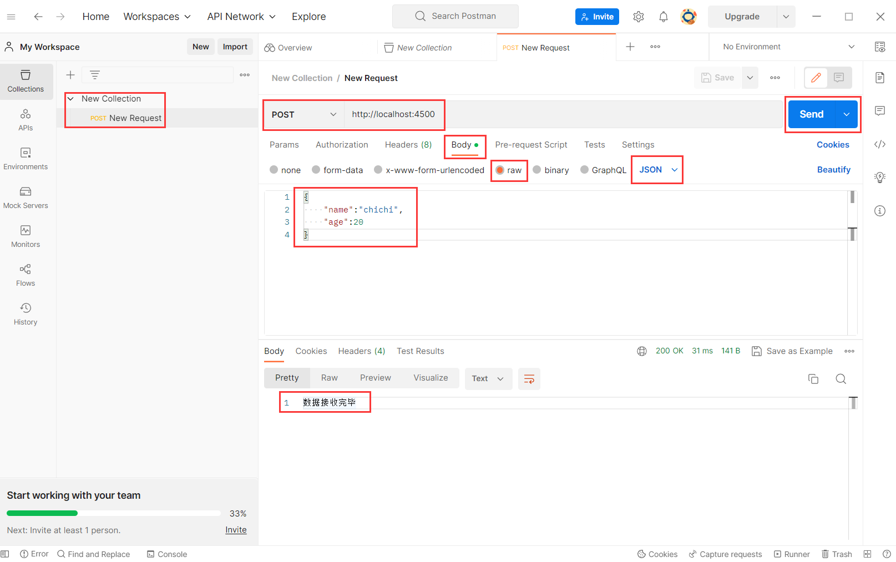
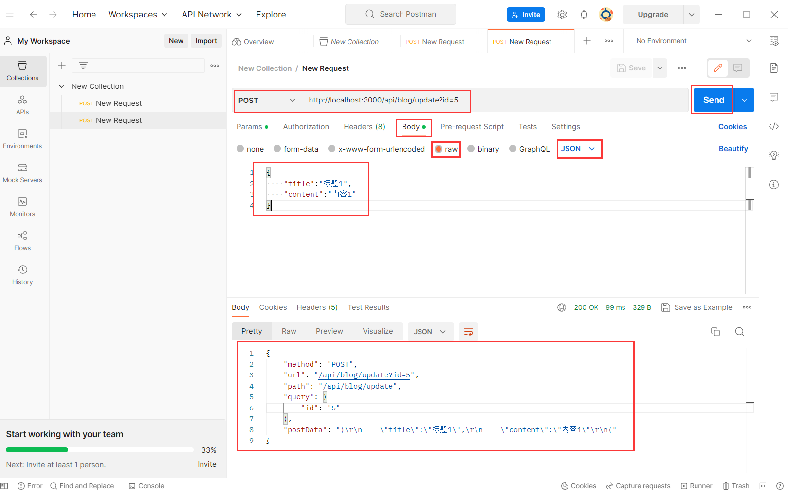

# nodejs

## 一、初识

### node.js简介

简单的说 Node.js 就是运行在服务端的 JavaScript。
Node.js 是一个基于 Chrome JavaScript 运行时建立的一个平台。
Node.js 是一个事件驱动 I/O 服务端 JavaScript 环境，基于 Google 的 V8 引擎，V8 引擎执行 Javascript 的速度非常快，性能非常好。

### node.js的作用

- 开发服务器应用（Express、Koa、Hapi、Socket.io）
- 开发工具类应用（Webpack、Vite、Babel）
- 开发桌面端应用(electron)

### node.js 应用的组成

1. **require 指令**：在 Node.js 中，使用 require 指令来加载和引入模块，引入的模块可以是内置模块，也可以是第三方模块或自定义模块。
2. **创建服务器**：服务器可以监听客户端的请求，类似于 Apache 、Nginx 等 HTTP 服务器。
3. **接收请求与响应请求**：服务器很容易创建，客户端可以使用浏览器或终端发送 HTTP 请求，服务器接收请求后返回响应数据。

### 创建node.js应用

#### 步骤一 使用require指令来加载和引入模块

```javascript
const module = require('module-name');
```

其中，module-name可以是一个文件路径（相对或绝对路径），也可以是一个模块名称，如果是一个模块名称，Node.js会自动从node_modules目录中查找该模块。
require指令会返回被加载的模块的导出对象，可以通过对该对象来访问模块中定义的属性和方法，如果模块中有多个导出对象，则可以使用解构赋值的方式来获取它们。
一般使用require指令来载入http模块，并将实例化的HTTP赋值给变量http：

```javascript
var http = require('http');
```

#### 步骤二 创建服务器

接下来使用http.createServer()方法创建服务器，并使用listen方法绑定8888端口。函数通过request，response参数来接收和响应数据。
在项目的根目录下创建一个叫server.js的文件，并写入以下代码：

```javascript
var http = require('http');

http.createServer(function(request,response){
  //发送HTTP头部
  //HTTP状态值：200:OK
  //内容类型：text/plain
  response.writeHead(200,{'Content-Type': 'text/plain'});

  //发送响应数据 "Hello World"
  response.end('Hello World\n');
}).listen(8888);

//终端打印如下信息
console.log('Server running at http://127.0.0.1:8888/');
```

**分析Node.js的HTTP服务器**：

1. 第一行请求`require`Node.js自带的http模块，并且把它赋值给`http`变量。
2. 然后调用`http`模块提供的函数：`createServer`。这个函数会返回一个对象，这个对象有一个叫做`listen`的方法，这个方法有一个数值参数，用于指定这个HTTP服务器监听的端口号。
3. 使用`var`和`const`声明变量的区别：
   在`var`被使用时，变量可以被重新赋值，而且可以在其作用域之外访问。在其他一些编程语言中，`var`也被用于声明全局变量。
   而当使用`const`时，变量不能被重新赋值，通常在声明常量时使用。此外，使用`const`声明的变量只在其作用域内有效，并且不能在其作用域之外访问。
   因此，在Node.js中，使用`const http = require('http')`更为常见，因为HTTP模块只需要在一处声明并引用即可，不需要在其他部分修改。而对于那些需要在不同的地方引用的模块，可以使用`var`声明该变量并随时更改。

## 二、 NPM 使用介绍

1. NPM是随同NodeJS一起安装的包管理工具，能解决NodeJS代码部署上的很多问题，常见的使用场景有以下几种：
   1. 允许用户从NPM服务器下载别人编写的第三方包到本地使用。
   2. 允许用户从NPM服务器下载并安装别人编写的命令行程序到本地使用。
   3. 允许用户将自己编写的包或命令行程序上传到NPM服务器供别人使用。
2. 本地安装
   1. 将安装包放在 ./node_modules 下（运行 npm 命令时所在的目录），如果没有 node_modules 目录，会在当前执行 npm 命令的目录下生成 node_modules 目录。
   2. 可以通过 require() 来引入本地安装的包。
   3. 使用本地安装 express框架： `npm install express`。
3. 全局安装
   1. 将安装包放在 /usr/local 下或者你 node 的安装目录。
   2. 可以直接在命令行里使用。

如果你希望具备两者功能，则需要在两个地方安装它或使用 npm link。
使用全局安装 express框架： `npm install express -g`

**Package.json 属性说明**
package.json 位于模块的目录下，用于定义包的属性。

- name - 包名。
- version - 包的版本号。
- description - 包的描述。
- homepage - 包的官网 url 。
- author - 包的作者姓名。
- contributors - 包的其他贡献者姓名。
- dependencies - 依赖包列表。如果依赖包没有安装，npm 会自动将依赖包安装在 node_module 目录下。
- repository - 包代码存放的地方的类型，可以是 git 或 svn，git 可在 Github 上。
- main - main 字段指定了程序的主入口文件，require('moduleName') 就会加载这个文件。这个字段的默认值是模块根目录下面的 index.js。
- keywords - 关键字

**常用命令**
npm常见包操作：

- **卸载模块** `npm uninstall express`
  卸载后，可以到 /node_modules/ 目录下查看包是否还存在，或者使用以下命令查看：`npm ls`
- **更新模块** `npm update express`
- **搜索模块** `npm search express`
- **创建模块**
  1. 使用 NPM 生成 package.json 文件，生成的文件包含了基本的结果。`npm init`
  2. 使用以下命令在 npm 资源库中注册用户（使用邮箱注册）： `npm adduser`
  3. 发布模块： `npm publish`

## 三、node.js REPL（交互式解释器）

Node.js REPL(Read Eval Print Loop:交互式解释器) 表示一个电脑的环境，类似 Windows 系统的终端或 Unix/Linux shell，我们可以在终端中输入命令，并接收系统的响应。
Node 自带了交互式解释器，可以执行以下任务：

- **读取** - 读取用户输入，解析输入的 Javascript 数据结构并存储在内存中。
- **执行** - 执行输入的数据结构
- **打印** - 输出结果
- **循环** - 循环操作以上步骤直到用户两次按下 ctrl-c 按钮退出。
Node 的交互式解释器可以很好的调试 Javascript 代码。

### REPL 命令

`node` - 启动node终端
`ctrl + c` - 退出当前终端。
`ctrl + c` 按下两次 - 退出 Node REPL。
`ctrl + d` - 退出 Node REPL.
`向上/向下` 键 - 查看输入的历史命令
`tab` 键 - 列出当前命令
`.help` - 列出使用命令
`.break` - 退出多行表达式
`.clear` - 退出多行表达式
`.save <filename>` - 保存当前的 Node REPL 会话到指定文件
`.load <filename>` - 载入当前 Node REPL 会话的文件内容。

### 使用变量

将数据存储在变量中，并在需要的时候使用它。
变量声明需要使用 var 关键字，如果没有使用 var 关键字变量会直接打印出来。
使用 var 关键字的变量可以使用 console.log() 来输出变量。

```powershell
x =10
console.log(x)
```

#### 下划线(_)变量

可以使用下划线(_)获取上一个表达式的运算结果

```powershell
x =10
y = 20
x + y
var sum =_
console.log(sum)
```

## 四、node.js基本概念

### 同步和异步

同步和异步是计算机中常用的两种执行方式，它们描述的是程序的执行方式。
同步是指程序在执行某个操作时需要等待当前操作完成后才能进行下一个操作，而异步则是指程序在发起某个操作之后可以继续执行其他操作。
同步执行通常在程序执行过程中会阻塞线程或进程，直到当前操作完成后才能继续执行下一步操作。例如，当用户从一个网站上请求数据时，如果该操作是同步执行的，则用户必须等待服务器响应并返回数据，才能在浏览器中看到结果。
异步执行则不同，程序不会等待当前操作完成，而是会继续执行其他操作。例如，当用户从一个网站上请求数据时，如果该操作是异步执行的，则用户可以继续浏览其他内容，等待该操作完成后再回来查看处理结果。
常见的异步执行方式包括回调函数、事件机制、Promise对象等。这些技术可以让客户端和服务端在执行长时间任务时不会出现阻塞现象。
以JavaScript为例，setTimeout就是一个异步执行的示例，因为它会在指定的时间间隔后执行一段代码，而不会阻塞程序的执行。而同步的例子则包括像for循环这样的代码，当遇到io阻塞（input/output，例如网络请求）时，程序就会处于等待状态，造成不必要的性能问题。
对于一个优秀的程序，通常需要根据实际场景选择最合适的执行方式。例如，在进行长时间操作时，异步执行可以大幅提高程序的性能和用户体验。但是，在某些情况下，同步执行更加可靠和安全，比如在进行文件读写操作时，文件IO必须等待读写操作完成后才能继续进行其他操作。

### node.js的异步编程

Node.js 异步编程的直接体现就是回调。
异步编程依托于回调来实现，但不能说使用了回调后程序就异步化了。
回调函数在完成任务后就会被调用，Node 使用了大量的回调函数，Node 所有 API 都支持回调函数。
例如，可以一边读取文件，一边执行其他命令，在文件读取完成后，我们将文件内容作为回调函数的参数返回。这样在执行代码时就没有阻塞或等待文件 I/O 操作。这就大大提高了 Node.js 的性能，可以处理大量的并发请求。
回调函数一般作为函数的最后一个参数出现：

```javascript
function foo1(name, age, callback) { }
function foo2(value, callback1, callback2) { }
//如：
var fs = require("fs");

fs.readFile('input.txt', function (err, data) {
    if (err) return console.error(err);
    console.log(data.toString());
});

console.log("程序执行结束!");
```

阻塞是按顺序执行的，而非阻塞是不需要按顺序的，所以如果需要处理回调函数的参数，就需要写在回调函数内。

### 数据类型

在Node.js中，支持的数据类型基本上和JavaScript中的一致。Node.js支持的数据类型包括：

1. 原始类型（Primitive types）：值都是不可变的（immutable），即一旦被创建，就不能被修改。例如，对一个字符串做一些修改操作，实际上是返回一个新的字符串，原来的字符串并没有被修改。
   - 字符串(String)：表示一串文本，可以进行字符串的拼接、截取、替换等操作。定义时需要用单引号、双引号或反引号将字符串内容包裹起来。
   - 数值(Number)：表示数值，可以进行算术操作。定义时不需要加引号，可以使用科学计数法等方式表示数值。
   - 布尔(Boolean)：表示值为真(True)或假(False)。主要用于控制流程中的判断条件。
   - 空（Null）：表示变量的值为空。
   - 未定义（Undefined）：表示变量未被初始化或不存在。
   - `Symbol`：表示独一无二的标识符。每个 Symbol 值都是完全唯一的，并且可以在整个应用程序中用作唯一标识符。在 Node.js 中，可以使用全局函数 Symbol() 来创建 Symbol 对象，并将其作为对象属性的键来使用。需要**注意**的是，Symbol 类型的属性是不可枚举的，即它们不会出现在对象的 for..in 循环中，也无法通过 Object.keys() 和 Object.getOwnPropertyNames() 方法获取。 但是，可以使用 Object.getOwnPropertySymbols() 方法来检索对象的 Symbol 属性。

    ```javascript
        let str = 'Hello';  //定义一个字符串
    let num1 = 123;  //定义一个数值
    let num2 = 3.14;  //定义一个小数
    let flag1 = true;  //定义一个布尔值
    let flag2 = false;
    if(flag1 && !flag2) {
      console.log("This is true");
    }
    let n = null;  //定义一个null值
    let u;  //设置一个未被初始化的变量

    const mySymbol = Symbol("mySymbol");  //使用 Symbol() 函数创建了一个名为 mySymbol 的 Symbol 对象
    const obj = {};

    obj[mySymbol] = "Hello World!";  //将mySymbol用作 obj 对象的属性键，该属性的值为字符串 "Hello World!"

    console.log(obj[mySymbol]); // 使用属性访问运算符和 mySymbol 键来访问该属性的值，会输出"Hello World!"
    ```

2. 对象类型（Object types）：值是可变的（mutable），即可以对其进行修改。对象类型的变量中存储的是一个指向对象内存地址的指针，因此对一个对象的修改会直接反映在指针所指向的内存地址上。
   - 正则表达式（RegExp）：是用于匹配字符串模式的对象。在 Node.js 中，可以通过字面量或者构造函数来创建一个正则表达式对象。
   - 日期（Date）：是用于表示日期和时间的对象。在 Node.js 中，可以通过 `new Date()` 构造函数来创建一个日期对象。
   - 数组(Array)：表示一组有序的元素的集合，可以通过下标访问和修改元素。定义时需要使用方括号和元素列表的形式。
   - 对象(Object)：表示一组属性的集合，可以使用属性名访问和修改属性值，也可以使用方法执行特定的操作。定义时需要使用花括号和键值对的形式。
   - `Buffer`：是一种用于处理二进制数据的数据类型，它类似于数组，但是其元素是 8 位无符号整数（即字节）。Buffer 数据类型可以通过 Buffer 类构造函数创建，并且还可以通过字面量语法创建。可以将 Buffer 视为一个字节数组，其中每个元素都是一个 8 位无符号整数值。可以用于处理网络流、文件系统操作、加密和解密等场景中的二进制数据。Buffer 类型具有许多有用的方法和属性，例如：
     - `Buffer.alloc(size[, fill[, encoding]])`: 创建指定大小的新的 Buffer 对象。
     - `buffer.toString([encoding[, start[, end]]])`: 将 Buffer 对象转换为字符串。
     - `buffer.write(string[, offset[, length]][, encoding])`: 将字符串写入缓冲区。
     - `buffer.copy(target[, targetStart[, sourceStart[, sourceEnd]]])`: 将缓冲区的内容复制到目标缓冲区。
     - `buffer.length`: 获取缓冲区的字节长度。
   - 函数(Function)：是一种对象（object）类型。在JavaScript中，函数是一等公民，即函数可以像其他变量一样被传递、赋值等操作，而且也可以拥有自己的属性和方法。因此，在Node.js中，函数也是一个对象，具有对象的特性，例如：
     - 函数可以作为一个参数传给其他函数，也可以作为返回值返回。
     - 函数具有属性和方法，例如`name`属性、`bind()`方法等。
     - 函数可以通过`new`关键字来创建构造函数，从而生成一个对象实例。

    ```javascript
    // 使用字面量创建正则表达式对象
    const regex1 = /hello/;

    // 使用构造函数创建正则表达式对象
    const regex2 = new RegExp('world');

    //构造一个日期对象，将其命名为now
    const now = new Date();
    console.log(now);  // 输出当前时间的日期对象

    //定义一个数组
    let arr1 = [1, 2, 3];
    let arr2 = ["apple", "banana", "cherry"];
    console.log(arr1[0]);
    console.log(arr2[1]);

    //定义一个对象
    let person = {
      name: "John",
      age: 30,
      greet: function() {
        console.log(`Hello, I'm ${this.name}`);
      }
    };
    person.greet();

    // 使用 Buffer 类构造函数创建 Buffer 对象
    const myBuffer = new Buffer([0x61, 0x62, 0x63]);

    // 使用字面量语法创建 Buffer 对象
    const anotherBuffer = Buffer.from("hello", "utf-8");

    //定义一个函数
    function foo() {
      console.log(typeof foo);  // "function"
    }

    console.log(typeof foo);  // "function"
    foo();
    ```

### 数据结构

数据结构(data structure)是**带有结构特性的数据元素的集合**，它研究的是数据的逻辑结构和数据的物理结构以及它们之间的相互关系，并对这种结构定义相适应的运算，设计出相应的算法，并确保经过这些运算以后所得到的新结构仍保持原来的结构类型。简而言之，数据结构是相互之间存在一种或多种特定关系的数据元素的集合，即带“结构”的数据元素的集合。“结构”就是指数据元素之间存在的关系，分为逻辑结构和存储结构。
数据结构是计算机科学中研究数据组织、存储、管理和访问的方法和原理。它是指在计算机程序设计中，**为了高效地处理数据而设计的一组数据存储方式和相应操作的方法**。常见的数据结构包括数组、链表、栈、队列、树、图等。数据结构可以帮助开发人员更加有效地组织和管理数据，提高代码质量和效率。
而数据类型是计算机语言中常用的一个概念，它是指**变量或表达式所表示的数据的种类**。不同的数据类型具有不同的特性和用途，例如 Number 能够进行数值计算，String 能够进行字符串操作等等。
数据类型强调的是数据的种类和属性，而数据结构则更关注数据的组织和管理方式。同时，数据结构还包括算法和操作等方面，可以帮助开发人员更好地理解和利用数据。

#### 一、线性结构

数据结构的元素之间存在一对一线性关系，所有结点都最多只有一个直接前趋结点和一个直接后继结点。

1. `Map`：是一种键值对集合，其中每个元素都是一个键值对。它允许任何类型的键（包括对象、函数和原始值），并且具有快速的查询和迭代特性。`Map` 对象可以通过构造函数创建，也可以使用字面量语法创建。`Map` 可以用于解决各种数据映射问题，例如将文件路径映射到文件内容、将 URL 路径映射到控制器方法、将商品 ID 映射到商品信息等等。`Map` 不仅可以表示单个键值对，还可以表示包含多个键值对的对象，这样就能够更加方便地处理复杂的数据结构。

    ```javascript
    // 使用构造函数创建 Map 对象
    const myMap = new Map();
    myMap.set("key1", "value1");
    myMap.set("key2", "value2");

    // 使用字面量语法创建 Map 对象
    const anotherMap = new Map([
      ["key1", "value1"],
      ["key2", "value2"],
    ]);
    ```

2. `Set`：是一种无重复元素的有序集合，它仅存储唯一值，并可以快速地添加、删除和查询元素。`Set` 对象可以通过构造函数创建，也可以使用字面量语法创建。`Set` 可以用于解决各种去重和排序问题，例如对文章标签进行去重、对访问日志的 IP 地址进行去重、对商品列表进行排序等等。`Set` 也可以与其他数据结构一起使用，例如与 `Map` 结合使用来实现缓存功能、与数组结合使用来进行交集并集等运算。

    ```javascript
    // 使用构造函数创建 Set 对象
    const mySet = new Set(["value1", "value2"]);

    // 使用字面量语法创建 Set 对象
    const anotherSet = new Set();
    anotherSet.add("value1");
    anotherSet.add("value2");
    ```

3. 链表（LinkedList）：是一种动态的、线性的数据结构，由一系列节点组成，每个节点包含数据和指向下一个节点的指针。与数组不同，链表中的节点可以分散在内存的不同位置，它的优点在于支持高效的插入和删除操作，而不需要像数组一样移动其他元素。适用场景：当需要频繁地进行插入和删除操作时，链表是一个比较好的选择。

    ```javascript
    // 定义链表节点
    class ListNode {
      constructor(val) {
        this.val = val;
        this.next = null;
      }
    }

    // 定义链表类
    class LinkedList {
      constructor() {
        this.head = null;
        this.tail = null;
        this.size = 0;
      }

      // 向链表尾部添加一个节点
      add(val) {
        const node = new ListNode(val);
        if (!this.head) {
          this.head = node;
          this.tail = node;
        } else {
          this.tail.next = node;
          this.tail = node;
        }
        this.size++;
      }

      // 删除链表中第一个值为val的节点
      remove(val) {
        let cur = this.head;
        let pre = null;
        while (cur) {
          if (cur.val === val) {
            if (!pre) {
              this.head = cur.next;
            } else {
              pre.next = cur.next;
            }
            this.size--;
            return true;
          }
          pre = cur;
          cur = cur.next;
        }
        return false;
      }
    }
    ```

4. 栈（Stack）：是一种后进先出（LIFO）的数据结构，可以通过 push 和 pop 操作实现元素的入栈和出栈。适用场景：当需要按照特定顺序处理元素时，或者需要进行嵌套操作的时候，栈是一个比较好的选择。

    ```javascript
    // 定义栈类
    class Stack {
      constructor() {
        this.stack = [];
      }

      // 入栈
      push(val) {
        this.stack.push(val);
      }

      // 出栈
      pop() {
        return this.stack.pop();
      }

      // 返回栈顶元素
      top() {
        return this.stack[this.stack.length - 1];
      }

      // 返回栈的大小
      size() {
        return this.stack.length;
      }

      // 判断栈是否为空
      isEmpty() {
        return this.stack.length === 0;
      }
    }
    ```

5. 队列（Queue）：是一种先进先出（FIFO）的数据结构，可以通过 enqueue 和 dequeue 操作实现元素的入队和出队。适用场景：当需要按照特定顺序处理元素时，或者需要进行顺序操作的时候，队列是一个比较好的选择。

    ```javascript
    // 定义队列类
    class Queue {
      constructor() {
        this.queue = [];
      }

      // 入队
      enqueue(val) {
        this.queue.push(val);
      }

      // 出队
      dequeue() {
        return this.queue.shift();
      }

      // 返回队首元素
      front() {
        return this.queue[0];
      }

      // 返回队列大小
      size() {
        return this.queue.length;
      }

      // 判断队列是否为空
      isEmpty() {
        return this.queue.length === 0;
      }
    }
    ```

#### 二、非线性结构

各个结点之间具有多个对应关系，一个结点可能有多个直接前趋结点和多个直接后继结点。

1. 堆（Heap）：是一种完全二叉树（Complete Binary Tree），且满足堆属性（heap property）。堆可以分为最大堆和最小堆两种，最大堆中每个父节点的值均大于等于其子节点的值，最小堆中每个父节点的值均小于等于其子节点的值。适用场景：当需要维护一组元素的最大值或最小值时，堆是一个比较好的选择。

    ```javascript
    // 定义堆类
    class Heap {
      constructor(comparator = (a, b) => a - b) {
        this.data = [];
        this.comparator = comparator;
      }

      // 获取堆的大小
      size() {
        return this.data.length;
      }

      // 获取堆顶元素
      top() {
        return this.data[0];
      }

      // 插入元素
      push(val) {
        this.data.push(val);
        this.siftUp(this.data.length - 1);
      }

      // 删除堆顶元素
      pop() {
        if (this.data.length === 0) return null;

        const top = this.data[0];
        const last = this.data.pop();
        if (this.data.length > 0) {
          this.data[0] = last;
          this.siftDown(0);
        }
        return top;
      }

      // 上移操作
      siftUp(index) {
        while (index > 0) {
          const parentIndex = (index - 1) >> 1;
          if (this.comparator(this.data[index], this.data[parentIndex]) > 0) {
            [this.data[index], this.data[parentIndex]] = [this.data[parentIndex], this.data[index]];
            index = parentIndex;
          } else {
            break;
          }
        }
      }

      // 下移操作
      siftDown(index) {
        const endIndex = this.data.length - 1;
        while (true) {
          const leftChildIndex = index * 2 + 1;
          const rightChildIndex = index * 2 + 2;
          let maxIndex = index;
          if (
            leftChildIndex <= endIndex &&
            this.comparator(this.data[leftChildIndex], this.data[maxIndex]) > 0
          ) {
            maxIndex = leftChildIndex;
          }
          if (
            rightChildIndex <= endIndex &&
            this.comparator(this.data[rightChildIndex], this.data[maxIndex]) > 0
          ) {
            maxIndex = rightChildIndex;
          }
          if (maxIndex !== index) {
            [this.data[index], this.data[maxIndex]] = [this.data[maxIndex], this.data[index]];
            index = maxIndex;
          } else {
            break;
          }
        }
      }
    }
    ```

2. 树（Tree）：是一种非线性的数据结构，由一组节点和一组边组成。每个节点可能有多个子节点，并且包含一个父节点。树被广泛应用于各种算法和数据处理领域。适用场景：当需要表示层级关系的时候，或者需要进行类似搜索、遍历等算法操作的时候，树是一个比较好的选择。

    ```javascript
    // 定义树节点类
    class TreeNode {
      constructor(val) {
        this.val = val;
        this.left = null;
        this.right = null;
      }
    }

    // 定义树类
    class Tree {
      constructor() {
        this.root = null;
      }

      // 插入节点
      insert(val) {
        const newNode = new TreeNode(val);
        if (!this.root) {
          this.root = newNode;
          return;
        }

        let curNode = this.root;
        while (true) {
          if (newNode.val < curNode.val) {
            if (!curNode.left) {
              curNode.left = newNode;
              break;
            }
            curNode = curNode.left;
          } else {
            if (!curNode.right) {
              curNode.right = newNode;
              break;
            }
            curNode = curNode.right;
          }
        }
      }

      // 前序遍历
      preOrderTraversal(callback) {
        function helper(node) {
          if (!node) return;
          callback(node.val);
          helper(node.left);
          helper(node.right);
        }
        helper(this.root);
      }

      // 中序遍历
      inOrderTraversal(callback) {
        function helper(node) {
          if (!node) return;
          helper(node.left);
          callback(node.val);
          helper(node.right);
        }
        helper(this.root);
      }

      // 后序遍历
      postOrderTraversal(callback) {
        function helper(node) {
          if (!node) return;
          helper(node.left);
          helper(node.right);
          callback(node.val);
        }
        helper(this.root);
      }
    }
    ```

3. 图（Graph）：是一种由节点和边组成的数据结构。节点可以是任何对象，边则表示两个节点之间的关系。图被广泛应用于各种算法和数据处理领域。适用场景：当需要表示复杂的关系网络时，或者需要进行类似搜索、遍历等算法操作的时候，图是一个比较好的选择。

    ```javascript
    // 定义图类
    class Graph {
      constructor() {
        this.adjList = new Map();
      }

      // 添加节点
      addNode(node) {
        if (!this.adjList.has(node)) {
          this.adjList.set(node, []);
        }
      }

      // 添加边
      addEdge(node1, node2) {
        this.adjList.get(node1).push(node2);
        // 如果是有向图则注释下面一行
        this.adjList.get(node2).push(node1);
      }

      // 广度优先遍历
      bfs(startNode, callback) {
        const visited = new Set();
        const queue = [];

        visited.add(startNode);
        queue.push(startNode);

        while (queue.length > 0) {
          const curNode = queue.shift();
          callback(curNode);

          const neighbors = this.adjList.get(curNode);
          for (const neighbor of neighbors) {
            if (!visited.has(neighbor)) {
              visited.add(neighbor);
              queue.push(neighbor);
            }
          }
        }
      }

      // 深度优先遍历
      dfs(startNode, callback) {
        const visited = new Set();

        function helper(node) {
          visited.add(node);
          callback(node);

          const neighbors = this.adjList.get(node);
          for (const neighbor of neighbors) {
            if (!visited.has(neighbor)) {
              helper(neighbor);
            }
          }
        }

        helper(startNode);
      }
    }
    ```

### 函数类型

Node.js支持的函数类型包括：普通函数(Function)、箭头函数(Arrow Function)、匿名函数(Anonymous Function)、回调函数(Callback Function)和生成器函数（Generator Function）。

- 普通函数(Function)：使用`function`关键字定义，可以具有任意数量和类型的参数，可以在函数内部使用`return`语句返回值。普通函数适用于大部分情况下，例如计算、处理数据、操作数据库等。例如：

  ```javascript
  function add(a, b) {
    return a + b;
  }
  console.log(add(3, 4));
  ```

- 箭头函数(Arrow Function)：使用箭头符号`=>`定义，可以简化函数定义，省略了`function`关键字、大括号和`return`语句。通常适用于只包含一个表达式的函数。箭头函数具有自己的 this 值，它绑定到定义函数时的上下文。箭头函数适用于需要更紧凑的语法并且不需要 this 引用的情况，例如过滤、映射和减少数组。例如：

  ```javascript
  let add = (a, b) => a + b;
  console.log(add(3, 4));
  ```

  - 在 JavaScript 中，`this` 关键字通常表示当前函数的执行上下文。它在不同的情况下具有不同的值，例如在全局作用域中，`this` 表示全局对象，在对象方法中，`this` 表示该对象本身。

- 匿名函数(Anonymous Function)：没有函数名的函数，通常作为其他函数的参数或返回值使用。适用于需要在其他函数中定义回调，但不需要在程序的其他部分重复使用该函数的情况。通常，匿名函数用于事件处理程序、定时器回调、异步任务等。例如：

  ```javascript
  let sayHello = function(name) {
    console.log(`Hello, ${name}!`);
  };
  sayHello("John");
  ```

- 回调函数(Callback Function)：是一种特殊的函数，作为函数参数传递给其他函数，在异步操作完成后被调用处理结果。在node.js中使用回调函数来完成异步操作。适用于需要异步执行代码的情况，例如读取文件、发送网络请求或从数据库检索数据等。例如：

  ```javascript
  function loadFile(filePath, callback) {
    // 异步读取文件内容
    fs.readFile(filePath, "utf8", (err, data) => {
      if(err) throw err;
      // 调用回调函数处理结果
      callback(data);
    });
  }
  loadFile("sample.txt", (data) => {
    console.log(`Contents: ${data}`);
  });
  ```

- 生成器函数（Generator Function）：使用 function* 关键字来定义，是 ES6 引入的一种新类型函数。生成器函数可以暂停并且当前状态可以保存，以便稍后恢复执行。通过使用 yield 关键字来控制函数的暂停和恢复。以下是一个简单的例子：

  ```javascript
  function* count() {
    let i = 0;
    while (true) {
      yield i++;
    }
  }
  ```

  生成器函数适用于需要逐步处理大量数据或需要在异步操作之间切换上下文的情况。例如，可以编写生成器函数来获取数据库中的所有记录，而无需一次性加载所有记录。每次需要时，只需调用生成器函数即可获取另一条记录。这有助于减少内存使用并提高应用程序的性能。
  另一个使用生成器函数的常见场景是同时处理多个异步操作。例如，在爬取网页时，可能需要同时下载多个页面。使用生成器函数，可以将所有异步请求放在一个循环中，并通过 `yield` 关键字暂停循环以等待响应。该代码看起来像同步代码，但实际上是在异步环境中运行的。

在实际使用中，需要根据具体场景选择合适的函数类型。例如，对于CPU密集型的任务，可以使用普通函数来提高性能；对于I/O密集型的任务，则可以使用异步函数来提高并发性能。

## 五、fs模块（fs API）

fs(file system，文件系统)模块可以实现与硬盘的交互，例如文件的创建、删除、重命名、移动，文件内容的写入、读取，以及文件夹的相关操作。

### 文件写入的应用场景

文件写入在计算机中是一个非常常见的操作，当需要持久化保存数据的时候，都应该使用文件写入。如：下载文件、安装软件、保存程序日志，如Git、编辑器保存文件、视频录制等。

### 同步/异步写入

writeFile异步写入语法：`fs.writeFile(file, data, [options,] callback)`

参数说明：

- `file` 文件名
- `data` 待写入的数据
- `option` 选项设置（可选）
- `callback` 写入回调

返回值：`undefined`

```javascript
/**
 * 需求：
 * 新建一个文件：座右铭.txt；写入内容：三人行，则必有我师焉。
*/

// 1. 导入模块
const fs = require('fs'); 
  //其中，const是声明符号，也可以用var、let；
  //第一个fs是变量的名称，可以自定义，只要满足命名要求即可;
  //require是一个全局函数，可以用来导入模块；
  //第二个fs是导入模块的名称，需要导入什么模块，就写什么。
// 2. 写入文件（异步）
fs.writeFile('./座右铭.txt', '三人行，则必有我师焉。', err => {
  //err 写入失败则返回错误对象，写入成功则返回null
  if (err) {
    console.log('写入失败');
    return; //将程序停掉
  }
  console.log('写入成功');
});
  
/**
 * 此处的writeFile就是一种异步的写入模式，当代码执行到writeFile这一行时，要进行磁盘写入，而writeFile会另起一个线程来完成磁盘写入的操作。
 * 也就是说现在有两个线程，一个是JS的主线程，来执行解析JS代码；另一个是执行磁盘写入操作的线程，一般称为I/O线程。
 * writeFile的异步表现为执行时不会等待结果的返回，而是直接执行之后的代码（JS主线程），而I/O线程在写入完毕后，会将回调函数压入到任务队列当中，等待JS主线程将初始化的代码执行完毕之后，再从任务队列中将回调函数取出来再执行。
*/
console.log(1+1);
//由于上面的writeFile使用了回调函数，这块代码会先执行后面的计算任务，再执行前面的写入任务。

//同步写入
fs.writeFileSync('./data.txt', 'test');
//writeFileSync的用法与writeFile相同，但比writeFile少一个回调函数的参数。
//JS主线程执行到writeFileSync代码时，会调起一个I/O线程去执行写入磁盘的任务，同时JS主线程会暂停，等待I/O线程执行完毕后再去执行之后的代码。
```

### 追加写入

```javascript
const fs = require('fs');

//异步写入
fs.appendFile('./座右铭.txt', '择其善者而从之，其不善者而改之。', err => {
  if(err){
    console.log('写入失败');
    return;
  }
  console.log('追加写入成功');
});
//同步写入
fs.appendFileSync('./座右铭.txt','\r\n温故而知新，可以为师矣。')

//writeFile 实现追加写入
fs.writeFile('./座右铭.txt', '户枢不蠹，流水不腐。', {flag:'a'}, err => {
  if (err){
    console.log('写入失败');
    return;
  }
  console.log('写入成功');
});
// 不加参数时，writeFile会将原文件的内容清空再进行写入；加了{flag:'a'}参数，则会追加写入。
```

### 流式写入

```javascript
const fs = require('fs');

//创建写入流对象
const ws = fs.createWriteStream('./观书有感.txt');
  //createWriteStream建立了一个打开文件的通道，要写入的时候，往通道里传入内容即可
  //而写入内容则需要借助write方法
//使用write方法
ws.write('半亩方塘一鉴开，\r\n');
ws.write('天光云影共徘徊。\r\n');
ws.write('问渠哪得清如许？\r\n');
ws.write('为有源头活水来。\r\n');
//关闭通道
ws.close(); //当js程序执行完毕，也会关闭通道，因此close方法的调用也是可选的
```

**流式写入适用场景**
程序打开一个文件是需要消耗资源的，流式写入可以减少打开关闭文件的次数。流式写入方式适用于大文件写入或频繁写入的场景，writeFile适合于写入频次较低的场景。

### 文件读取的应用场景

电脑开机、程序运行、编辑器打开文件、查看图片、播放视频、播放音乐、Git查看日志、上传文件、查看聊天记录等

### 异步读取 readFile & 同步读取 readFileSync

语法：`fs.readFile(path, [options,] callback)`
参数说明：

- `path` 文件路径
- `options` 选项配置
- `callback` 回调函数
  - 其中 `callback` 有两个参数，前者接收错误信息，后者接收要读取的文件内容

返回值：`undefined`

```javascript
const fs = require('fs');
fs.readFile('./观书有感.txt', (err,data) => {
  if (err) {
    console.log('读取失败');
    return;
  }
  //读取数据，会显示buffer数据
  //console.log(data); 
  //将读取到的内存数据以UTF-8的编码方式将其转化为字符串
  console.log(data.toString());
});

//同步读取
let data = fs.readFileSync('./观书有感.txt');
console.log(data.toString());
```

### 流式读取 createReadStream

`createReadStream`可以将大型文件分成多个可读流块进行读取，可以减轻内存压力，并且通过监听事件处理读取到的数据和错误。
使用`createReadStream`方法，可以指定要读取的文件路径和一些可选的配置选项，例如读取的起始偏移量、结束偏移量等。

```javascript
const fs = require('fs');

//创建文件读取流,并将其赋值给stream变量
const stream = fs.createReadStream('/path/to/myFile.txt');

//通过监听该可读流对象的三个事件来处理读取到的数据、结束事件和错误事件。

//监听到data事件时，回调函数就会执行
//可以使用该回调函数来处理读取到的二进制数据块
stream.on('data', (chunk) => {
  console.log(`Received ${chunk.length} bytes of data.`);
});

//当读取完成时，end事件就会被触发
stream.on('end', () => {
  console.log('Data reading finished.');
});

//当出现读取错误时，error事件就会触发
stream.on('error', (err) => {
  console.error(`Error occurred while reading the file: ${err}`);
});
```

```javascript
const fs = require('fs');

//创建读取流对象
const rs = fs.createReadStream('../资料/笑看风云.mp4');

//绑定data 事件
//chunk，块，每当从文件中读取一块数据，就会触发执行一次回调，并将读取到的内容传递给chunk这个形参，让其处理
rs.on('data', chunk = > {
  console.log(chunk); //会读取到buffer数据
  console.log(chunk.length); //每次会读取 65536字节的数据，即64KB
})

//end 可选事件
rs.on('end',() => {
  console.log('读取完成');
})
```

### 文件复制

```javascript
const fs = require('fs');
//调用process模块，可使用其内置方法获取代码运行的内存占用量
const process = require('process');
//方式一：readFile（要占用一个视频大小的内存空间）
//1. 读取文件内容
let data = fs.readFileSync('../资料/笑看风云.mp4');
//2. 写入文件
fs.writeFileSync('../资料/笑看风云-1.mp4', data);
//3. 获取readFile占用的内存
console.log(process.memoryUsage()); //直接看res

//方式二：流式操作（理想状态下只需要占用64KB的内存空间，占用的资源更少）
//1. 创建读取流对象
const rs = fs.createReadStream('../资料/笑看风云.mp4');
//2. 创建写入流对象
const ws = fs.createWriteStream('../资料/笑看风云-2.mp4')
//3.1 绑定 data 事件
rs.on('data', chunk => {
  ws.write(chunk);
});
//4. 获取流式操作占用的内存
rs.on('end', () => {
  console.log(process.memoryUsage());
});

//3.2 可替代3.1操作
rs.pipe(ws); //通过管道，将读取流交给写入流
```

由于读取文件的速度要比写入文件的速度快，在流式操作中，往往第一块数据写入还没完成，第二块数据就已经读取出来，放到了内存中，导致占用的内存空间一般会大于理想状态的64KB。

### 文件重命名和移动

语法：`fs.rename(oldPath, newPath, callback)`；`fs.renameSync(odlPath, newPath)`
参数说明：

- `oldPath` 文件当前路径
- `newPath` 文件新路径
- `callback` 操作后的回调函数

```javascript
fs.rename('./观书有感.txt', './论语/观书有感.txt', (err) => {
  if(err) throw err;
  console.log('移动完成')
});

fs.renameSync('./座右铭.txt', './论语/我的座右铭.txt');
```

### 文件的删除

语法：`fs.unlink(path, callback)`；`fs.unlikSync(path)`
参数说明：

- `path` 文件路径
- `callback` 回调函数

```javascript
const fs = require('fs');

fs.unlink('./test.txt', err =>{
  if (err) throw err;
  console.log('删除成功')
});

fs.unlink('./test2.txt');

//调用14.4版本引入的新方法rm 对应的同步方法 rmSync
fs.rm('./test3.txt', err => {
  if (err) {
    console.log('删除失败');
    return;
  }
  console.log('删除成功');
})
```

### 文件夹操作

#### 1. 创建文件夹： mkdir/mkdirSync

- 语法：`fs.mkdir(path, [options,] callback)`； `fs.mkdirSync(path,[options])`
- 参数说明：
  - `path` 文件夹路径
  - `options` 选项配置（可选）
  - `callback` 回调函数

```javascript
const fs = require('fs');
fs.mkdir('./html', err => {
  if (err) {
    console.log('创建失败');
    return;
  }
  console.log('创建成功');
})
//递归创建
const fs = require('fs');
fs.mkdir('./a/b/c', {recursive: true}, err => {
  if (err) {
    console.log('创建失败');
    return;
  }
  console.log('创建成功');
})
```

#### 2. 读取文件夹： readdir/readdirSync

```javascript
const fs = require('fs');
fs.readdir('./资料', (err, data) => {
  if (err) {
    console.log('读取失败');
    return;
  }
  console.log('读取失败');
})
```

#### 3. 删除文件夹： rmdir/rmdirSync

```javascript
const fs = require('fs');
fs.rmdir('./html', err => {
  if (err) {
    console.log('删除失败');
    return;
  }
  console.log('删除成功');
})
//递归删除(rmdir也支持递归，但更推荐使用rm)
const fs = require('fs');
fs.rm('./a', {recursive: true}, err => {
  if (err) {
    console.log(err);
    return;
  }
  console.log('删除成功');
})
```

### 查看资源状态： stat/statSync

- 语法：`fs.stat(path, [options,] callback)`； `fs.statSync(path,[options])`
- 参数说明：
  - `path` 文件夹路径
  - `options` 选项配置（可选）
  - `callback` 回调函数

```javascript
const fs = require('fs');

fs.stat('../资料/笑看风云.mp4', (err, data) => {
  if (err) {
    console.log('查看失败');
    return;
  }
  console.log(data); //输出中size表文件大小，birthtime表文件创建时间，atime表最后的访问时间，mtime表最后的修改时间，ctime表最后一次修改文件状态的时间
  console.log(data.isFile()); //使用isFile()方法，判断查看的是否为文件
  console.log(data.isDirectory()); //判断查看的资源是否为文件夹
})
```

### fs相对路径的bug与解决

**bug**：fs相对路径的参照物并不是js文件的所在目录，而是命令行的工作目录，因此如果执行js的目录不一致，js运行的结果也会不一致
**解决方法**：引入 `__dirname`，使用绝对路径。`__dirname`相当于一个全局变量，保存的是所在文件的所在目录的绝对路径

```javascript
const fs = require('fs');
fs.writeFileSync(__dirname + '/index.html', 'look'); //使用当前目录与文件路径进行拼接，达到绝对路径的效果
```

### 批量重命名

```javascript
const fs = require('fs');
const files = fs.readdirSync('./code');
//将1-xx的文件重命名为01-xx
//遍历数组
files.forEach(item => {
  //拆分文件名
  let data = item.split('-');
  let [num, name] = data;
  //判断
  if (Number(num) < 10) { //Number强制转换为数值类型来做判断
    num = '0' + num;
  }
  //创建新的文件名
  let newName = num + '-' + name;
  //重命名
  fs.renameSync(`./code/${iterm}`, `./code/${newName}`);
})
```

### path模块

| API | 说明 |
| :-- | :-- |
| path.resolve | 拼接规范的绝对路径 |
| path.sep | 获取操作系统的路径分割符 |
| path.parse | 解析路径并返回对象 |
| path.basename | 获取路径的基础名称 |
| path.dirname | 获取路径的目录名 |
| path.extname | 获取路径的扩展名 |

```javascript
const fs = require('fs');
const path = require('path');

console.log(path.resolve(__dirname, './index.html')); //使用path.resolve解决linux、Windows跨平台路径分隔符'/'与'\'不一致的问题
console.log(path.sep);  //输出当前操作系统的路径分隔符
console.log(__filename);  //__filename保存了当前文件的绝对路径
let str = 'D:\\nodeJS\\code\\path.js';
console.log(path.parse(str))
```

## 六、http模块

### HTTP请求报文

HTTP（Hyper Text Transfer Protocol，超文本传输协议）请求报文是客户端向服务器发送请求时所包含的数据，它由请求行、请求头和请求体三部分组成。

#### 请求行（Request Line）

请求行为HTTP请求报文的第一行。请求行包含三个数据：请求方法、URL和HTTP版本号。格式如：`GET /index.html HTTP/1.1`，其中 `GET` 是 HTTP 方法，`/index.html` 是请求的资源路径，`HTTP/1.1` 是 HTTP 的版本号。

1. 请求方法：GET 主要用于获取数据；POST 主要用于新增数据；PUT/PATCH 主要用于更新数据；DELETE 主要用于删除数据；另外还有HEAD、OPTIONS、CONNECT、TRACE等方法使用相对较少。
2. URL（Uniform Resource Locator，统一资源定位符），是浏览器能够定位到服务器中的资源。URL由协议名、主机名、端口号、路径、查询字符串及片段标识符组成。

   - 协议（Protocol）：URL 的协议是指访问该资源所采用的通信协议，常见的协议有 HTTP、HTTPS、FTP、TELNET 等。URL 中必须包括协议名，例如：`http://`、`https://`、`ftp://` 等。
   - 主机名（Host）：主机名用于表示所访问资源所在的主机名或 IP 地址。例如，在 `https://www.example.com/path/to/resource.html` 这个 URL 中，`www.example.com` 就是主机名。
   - 端口号（Port）：端口号是用于区分同一主机上不同服务的标识符，其值通常可以省略。如果 URL 不指定端口号，则使用默认端口号，例如 HTTP 协议的默认端口号为 80，HTTPS 协议的默认端口号为 443。
   - 路径（Path）：路径指访问的资源在服务器上的路径，由若干个路径段组成，各路径段之间使用斜杠（/）分隔。例如，在 `https://www.example.com/path/to/resource.html` 这个 URL 中，`/path/to/resource.html` 就是路径。
   - 查询字符串（Query）：查询字符串指传递给服务器的参数，格式为 key=value，多个参数之间使用 & 符号分隔。例如，在 `https://www.example.com/search?q=node.js` 这个 URL 中，`q=node.js` 就是查询字符串。
   - 片段标识符（Fragment）：如果 URL 指向的是一个 HTML 页面或某个元素，那么片段标识符可以指定页面中的某个位置或具体的元素 ID。片段标识符位于 URL 的末尾，以 # 符号开头，例如 `https://www.example.com/index.html#section1`。
3. HTTP（Hyper Text Transfer Protocol，超文本传输协议）是一种用于传输超媒体文档的协议。HTTP 协议的版本有以下几个：
   1. HTTP/0.9：最初的版本，只支持 GET 请求方法，不支持请求头和响应头，也没有状态码和错误处理等功能。该版本已经被淘汰。
   2. HTTP/1.0：在 HTTP/0.9 的基础上增加了多种请求方法、请求头、响应头、状态码和错误处理等功能，使得 HTTP 协议更加完善和灵活。该版本也已经被淘汰。
   3. HTTP/1.1：相对于 HTTP/1.0，HTTP/1.1 更加高效和安全，具有以下新特性：
      - 持久连接（Persistent Connection）：允许客户端和服务器之间在一次 TCP 连接上发送和接收多个 HTTP 请求和响应，避免了每次请求都需要建立新的 TCP 连接的开销。
      - 流水线（Pipeline）：允许客户端同时发送多个请求到服务器，而无需等待每个请求的响应，从而提高了响应速度。
      - 范围请求（Range Request）：允许客户端只请求文档的一部分，并只返回所请求部分的内容。
      - 增量更新（Incremental Update）：允许服务器只向客户端发送所请求文档的增量更新，可以大大减小数据传输的开销。
      - 缓存控制（Cache Control）：允许客户端和服务器控制缓存的行为，优化了 HTTP 的性能和效率。
   4. HTTP/2：相对于 HTTP/1.1，HTTP/2 更加高效和安全，具有以下新特性：
      - 二进制分帧（Binary Framing）：将 HTTP 数据划分为更小的、独立的二进制帧，使得多个帧可以在一个 TCP 连接上交错传输。
      - 多路复用（Multiplexing）：允许同时发送多个请求和响应，从而避免了 HTTP/1.x 中的队头阻塞问题。
      - 首部压缩（Header Compression）：使用 HPACK 算法对 HTTP 首部进行压缩，减少了网络传输的开销。
      - 服务器推送（Server Push）：允许服务器预先向客户端推送一些可能需要的资源，从而优化了客户端的性能。
   5. HTTP/3（QUIC）：相对于 HTTP/2，HTTP/3 更加高效和安全，基于 UDP 实现，具有以下新特性：
      - 0-RTT：允许客户端在没有与服务器建立连接的情况下发送请求，从而进一步提高了响应速度。
      - 双向流（Bidirectional Stream）：允许客户端和服务器之间同时发送和接收请求和响应，进一步避免了队头阻塞问题。
      - 更快的重传机制：基于 QUIC 协议的特性，重新设计了传输层协议，使得 HTTP/3 在面对数据包丢失或延迟时，更加高效地进行重传。

#### 请求头（Request Header）

请求头为HTTP报文从请求行到空行（Blank Line）（空行用于分隔请求头和请求体，即仅包含一个换行符 `\r\n` ）之间的内容，包含了客户端向服务器发送请求的相关信息，如客户端类型、请求时间、内容类型、长度等等。格式为：`Key: Value`，多个键值对之间使用换行符 `\r\n` 分隔。常见的 HTTP 请求头包括：

1. `User-Agent`：客户端（如浏览器）的标识字符串，用于告诉服务器发送请求的客户端应用程序的类型和版本号。
   - Web 浏览器名称及版本号。
   - 操作系统类型及版本号。
   - 应用程序名称及版本号。
2. `Accept`：客户端接受的数据类型列表，用于告诉服务器客户端所期望的服务器响应的 MIME 类型。
3. `Referer`：表示页面来源，即客户端从哪个页面转跳过来的。Referer 的值通常为请求页面的 URL。
4. `Cookie`：客户端的 Cookie 信息，用于保存客户端的状态。Cookie 的格式为键值对，如 `Cookie: name=value`。
5. `Authorization`：表示用户认证信息，一般用于 HTTP 基本认证和摘要认证。
6. `Content-Type`：表示请求数据的 MIME 类型，主要用于 POST 请求中提交表单数据或上传文件时指定数据格式。
   - application/json：表示请求主体是 JSON 格式的数据。
   - application/x-www-form-urlencoded：表示请求主体是 URL 编码形式的表单数据。
   - multipart/form-data：表示请求主体是二进制数据，用于上传文件等操作。
7. `Content-Length`：表示请求数据的长度，主要用于 POST 请求中提交表单数据或上传文件时，告诉服务器请求数据的总字节数。
8. `If-None-Match`：表示缓存校验信息，用于判断客户端是否需要从服务器重新获取资源。
9. `Range`：表示请求部分资源，用于实现断点续传功能。
10. `Connection`：表示是否需要持久连接（keep-alive）以及如何处理连接。下面是 Connection 常见的选项：
    - keep-alive：指定客户端和服务器之间保持连接是否应该持续不断，以便后续请求可以复用连接。
    - close：指定连接在响应完毕后立即关闭，以避免浪费资源。
11. `Content-Encoding`：表示请求主体编码的类型，常见的编码格式有：
    - gzip：表示使用 gzip 压缩算法对主体进行压缩。
    - deflate：表示使用 deflate 压缩算法对主体进行压缩。
    - br：表示使用 Brotli 压缩算法对主体进行压缩。
参考网址：`https://developer.mozilla.org/zh-CN/docs/Web/HTTP/Headers`

#### 请求体（Request Body）

请求体为HTTP报文空行之后的内容，是 HTTP 请求报文的主体部分，用于传递客户端向服务器发送的数据，通常在 POST、PUT 等方法中使用。请求体的格式和内容根据请求的对象和目的而异，可以包含纯文本、二进制数据、JSON 数据等等。

常见的请求体类型及其格式有：

1. `application/x-www-form-urlencoded`：这是最常见的请求体格式，用于传递表单数据。格式为 `key1=value1&key2=value2&key3=value3`，其中 key1、key2、key3 表示表单字段的名称，value1、value2、value3 表示表单字段的值。这种格式的请求体通常用于 HTML 表单提交。
2. `multipart/form-data`：这种格式也用于传递表单数据，但支持上传文件和二进制数据。格式为：

  ```MIME
  --boundary
  Content-Disposition: form-data; name="key1"

  value1
  --boundary
  Content-Disposition: form-data; name="key2"; filename="filename.jpg"
  Content-Type: image/jpeg

  (binary data)
  --boundary--
  ```

  其中 boundary 是分隔符，可以自定义，用于区分不同的字段和文件。Content-Disposition 用于指定该部分的类型和名称，name 表示字段名，filename 表示上传的文件名。Content-Type 用于指定数据类型，binary data 表示二进制数据。
3. `application/json`：这种格式用于传递 JSON 数据。格式为一个 JSON 对象，包含多个键值对，如 `{ "key1": "value1", "key2": "value2" }`。这种格式的请求体通常用于 RESTful API 接口。
4. `application/octet-stream`：这种格式用于传递二进制数据，如图片、音频、视频等文件。直接将二进制数据放在请求体中即可。

总之，HTTP 请求体可以传递各种不同类型的数据，它的格式和内容根据实际需要而定。客户端在发送请求时需要根据服务器要求指定正确的请求体格式和数据内容，以便服务器能够正确地处理请求并返回正确的响应。同时，客户端也需要注意请求体大小的限制，避免过大的请求体导致网络传输性能下降或服务器无法处理。

### HTTP响应报文

HTTP 响应报文是服务器向客户端返回响应时所包含的数据，它由状态行、响应头和响应体三部分组成。

#### 状态行（Status Line）

又称响应行。状态行包含了 HTTP 版本号、状态码和状态描述。格式如：`HTTP/1.1 200 OK`，其中 `HTTP/1.1` 是 HTTP 的版本号，`200` 是状态码（表示请求成功），OK 是状态描述。

1. HTTP 版本号：表示所使用的 HTTP 协议的版本。常用的 HTTP 版本有 HTTP/1.0 和 HTTP/1.1。
2. 状态码：表示服务器对请求处理的结果，主要分为五类：
   - 1xx: 信息性状态码，表示服务器已经接收到请求，正在进行进一步处理。
   - 2xx: 成功状态码，表示请求已经成功被服务器接收、理解、并处理。
   - 3xx: 重定向状态码，表示需要客户端进一步操作才能完成请求。
   - 4xx: 客户端错误状态码，表示服务器无法处理客户端发送的请求。
   - 5xx: 服务器错误状态码，表示服务器在处理请求时发生了错误。
3. 状态描述：是与状态码对应的文字描述，通常为英文短语，描述了当前状态的意义。状态描述可以帮助客户端理解服务器的状态，并根据需要采取相应的措施。常见的状态码包括:
   - 100 Continue：请求者应该继续发送请求。
   - 200 OK：请求成功，已经得到所要求的内容。
   - 201 Created：已经成功创建了资源。
   - 204 No Content：请求成功，但没有返回任何内容。
   - 301 Moved Permanently：请求的资源被永久移动到其他位置。
   - 302 Found：请求的资源被临时移动到其他位置。
   - 304 Not Modified：请求的资源未修改，可以直接使用缓存的版本。
   - 400 Bad Request：请求出现语法错误或参数有误。
   - 401 Unauthorized：需要用户进行身份验证。
   - 403 Forbidden：服务器拒绝提供服务，通常是因为权限不足。
   - 404 Not Found：请求的资源不存在。
   - 500 Internal Server Error：服务器出现错误，无法完成请求。
   - 503 Service Unavailable：服务器当前无法处理请求，可能是因为过载或正在维护等原因。
参考网址：`https://developer.mozilla.org/zh-CN/docs/Web/HTTP/Status`

#### 响应头（Response Header）

HTTP响应报文中的响应头是指HTTP服务器返回给客户端的元信息，用于描述响应消息的属性和特征，如服务器类型、响应时间、内容类型、长度等等。由一系列的键值对组成，格式为：`Key: Value`，多个键值对之间使用换行符（\r\n）分隔。包括通用头、响应头和实体头三部分。

1. 通用头：通用头是一些可供任意类型消息使用的首部，包括Date、Connection、Cache-Control、Pragma、Trailer、Transfer-Encoding和Upgrade等。常见的通用头和选项如下：
   - Date：响应消息产生的时间。
   - Connection：设置连接是否关闭。
   - Cache-Control：缓存控制选项，如no-cache、max-age、private等。
   - Pragma：旧版HTTP协议的缓存控制选项。
   - Trailer：指明消息尾部是否包含额外的头部。
   - Transfer-Encoding：指定消息的传输编码方式。
   - Upgrade：升级HTTP协议。
2. 响应头：响应头是针对响应报文而定义的首部，其中包括了一些描述响应实体的属性和特征的参数，如Content-Type、Content-Length、Content-Encoding、Content-Language和Server等。常见的响应头和选项如下：
   - Content-Type：指定响应消息主体的MIME类型，如text/html、application/json等。
   - Content-Length：指定响应消息主体的长度。
   - Content-Encoding：指定响应消息主体的编码方式，如gzip、deflate等。
   - Content-Language：指定响应消息主体的自然语言，如en、zh等。
   - Server：指定服务器使用的软件名称和版本号。
3. 实体头：实体头是针对响应实体而定义的首部，用于描述实体的属性和特征，如Content-Disposition、Content-Encoding、Content-Language和Expires等。常见的实体头和选项如下：
   - Content-Disposition：指定响应消息主体的处理方式，如inline或attachment。
   - Content-Location：指定响应消息主体的URL地址。
   - Content-Encoding：指定响应消息主体的编码方式，如gzip、deflate等。
   - Content-Language：指定响应消息主体的自然语言，如en、zh等。
   - Expires：指定此响应消息的过期时间。

#### 响应体（Response Body）

HTTP响应报文中的响应体（也称为响应消息主体）是响应服务器处理请求后返回的实际数据，通常在 GET、POST、PUT 等方法中使用，它位于响应报文的第四部分。响应体的格式和内容根据服务器处理结果和目的而异，即完全取决于HTTP响应的类型和状态，可以是纯文本、二进制数据、HTML文档、XML文件、JSON文本、图片、音频、视频等类型的数据。HTTP响应体由以下几个部分组成：

1. 媒体类型：在HTTP响应头中的Content-Type字段中指定了响应体的媒体类型（也称为MIME类型），例如text/html、image/png、application/json等。
2. 媒体长度：在HTTP响应头中的Content-Length字段中指定了响应体的长度，以字节为单位。如果响应体的长度无法确定，则此字段会被省略。
3. 媒体编码：在HTTP响应头中的Content-Encoding字段中指定了响应体的编码方式，例如gzip、deflate等。如果响应体未经过编码，则此字段会被省略。
4. 服务器信息：在HTTP响应头中的Server字段中指定了响应所使用的服务器软件名称和版本。
5. Cache 控制：在HTTP响应头中的Cache-Control和Expires字段中指定了缓存的相关信息。当响应需要缓存时，这些字段会用于指定缓存策略。例如，Cache-Control: public, max-age=86400表示响应可以被公开缓存，并在86400秒后过期。
6. 响应体实际数据：HTTP响应体的实际数据是按照Content-Length指定的长度发送的二进制数据流，这些数据可以是多种类型的媒体数据。
需要注意的是，对于某些状态码的响应（如301、302等），实际的响应体数据可能并不包含在响应消息本身中，而是通过其他方式（如重定向链接）提供给了客户端。
HTTP响应报文中的响应体是响应服务器处理请求后返回的实际数据，其格式和内容具有很高的灵活性和可定制性，可以满足各种应用场景的需要。

### 创建HTTP服务器

在Node.js中，使用http.createServer可以创建一个HTTP服务器，用于处理来自客户端的HTTP请求。createServer方法有多种传参方法，常见的有两种：

1. 只传入一个回调函数作为参数
    这种传参方式最简单，只需要一个回调函数作为参数即可。该回调函数会在每次有HTTP请求时被调用，需要通过request和response等参数进行处理响应。
    http.createServer()方法在调用的时候会接受两个实参，第一个实参是请求报文的封装对象，借助此对象，可以获取到请求报文中的相关内容，包括请求行、请求头、请求体中任意部分的任意信息；第二个实参是响应报文的封装对象，借助此对象，可以设置浏览器的响应结果，包括响应行、响应头、响应体中任意部分的任意信息。
    每当服务接收到一次HTTP请求，就会触发一次回调函数的执行。

    ```javascript
    const http = require('http');

    http.createServer((req, res) => {
      res.writeHead(200, {'Content-Type': 'text/plain'});
      res.end('Hello World\n');  //设置响应体，并结束响应
    }).listen(8080, 'localhost');  //监听端口，并启动服务

    //也可以写成这样
    const server = http.create((request, response) => {
      res.writeHead(200, {'Content-Type': 'text/plain'});
      response.end('Hello World\n');
    })
    server.listen(8080,() => {
      return 0;
    })
    ```

2. 传入options对象和回调函数作为参数
    这种传参方式可以传入一个options对象，包括参数host、port、path、method、headers等，用于配置创建HTTP服务器的一些选项；还可以传入一个回调函数作为参数，该回调函数会在服务器启动成功时被调用。示例如下：

    ```javascript
    const http = require('http');

    const options = {
      host: 'localhost',
      port: 8080,
      path: '/test',
      method: 'POST',
      headers: {
        'Content-Type': 'application/json'
      }
    };

    const server = http.createServer(options, (req, res) => {
      res.writeHead(200, {'Content-Type': 'text/plain'});
      res.end('Hello World\n');
    });

    server.listen(() => {
      console.log(`Server running at http://${options.host}:${options.port}/`);
    });
    ```

#### HTTP服务的注意事项

1. 当服务启动后，更新代码 **必须重启服务才能生效**
2. 响应内容中文乱码的解决办法： `response.setHeader('content-type', 'text/html;charset=utf-8');`
3. HTTP协议默认端口是80。HTTP服务开发常用端口有3000，8080，8090，9000等。如果端口被其他程序占用 `Error: listen EADDRINUSE: address already in use :::9000`，可以使用 **资源监视器** 找到占用端口的程序，然后使用 **任务管理器** 关闭对应的程序。

### 获取HTTP请求报文-request

想要获取请求的数据，需要通过`request`模块来发送 HTTP 请求。request有一些常用方法：

#### 请求方法

1. `request.get(url[, options][, callback])`：发送 GET 请求，并返回响应内容。适用场景：获取资源或数据等。

   ```javascript
   const request = require('request');
   
   request.get('http://example.com', (error, response, body) => {
     if (error) {
       console.error(error);
     } else {
       console.log(body);
     }
   });
   ```

2. `request.post(url[, options][, callback])`：发送 POST 请求，并返回响应内容。适用场景：提交表单、上传文件等。

   ```javascript
   const request = require('request');
   
   const data = { name: 'Alice', age: 25 };
   
   request.post('http://example.com/api/user', { form: data }, (error, response, body) => {
     if (error) {
       console.error(error);
     } else {
       console.log(body);
     }
   });
   ```

3. `request.put(url[, options][, callback])`：发送 PUT 请求，并返回响应内容。适用场景：更新资源或数据等。

   ```javascript
   const request = require('request');
   
   const data = { name: 'Bob', age: 30 };
   
   request.put('http://example.com/api/user/123', { json: data }, (error, response, body) => {
     if (error) {
       console.error(error);
     } else {
       console.log(body);
     }
   });
   ```

4. `request.delete(url[, options][, callback])`：发送 DELETE 请求，并返回响应内容。适用场景：删除资源或数据等。

   ```javascript
   const request = require('request');
   
   request.delete('http://example.com/api/user/123', (error, response, body) => {
     if (error) {
       console.error(error);
     } else {
       console.log(body);
     }
   });
   ```

在每个方法中，参数 `options` 是可选的，可以用来设置请求头、超时时间、代理服务器等。此外，所有方法都支持传入回调函数，在请求完成后执行。如果不需要回调函数，则可以使用 Promise 或 async/await 来进行异步处理。

请求方法还可以使用链式调用来设置更多选项，例如：

```javascript
const request = require('request');

request.get('http://example.com')
  .on('response', (response) => {
    console.log(response.statusCode);
  })
  .on('error', (error) => {
    console.error(error);
  });
```

#### 其他常用方法

1. `method`：用于设置请求方法。

   ```javascript
   const request = require('request');
   
   request({
     method: 'PUT',
     url: 'http://example.com/api/user/123',
     json: { name: 'Bob', age: 30 }
   }, (error, response, body) => {
     if (error) {
       console.error(error);
     } else {
       console.log(body);
     }
   });
   ```

2. `headers`：用于设置请求头，可以是对象或者数组格式。

   ```javascript
   const request = require('request');
   
   request({
     url: 'http://example.com',
     headers: {
       'User-Agent': 'Mozilla/5.0',
       'Accept-Language': ['en-US', 'en-GB']
     }
   }, (error, response, body) => {
     if (error) {
       console.error(error);
     } else {
       console.log(body);
     }
   });
   ```

3. `qs` 或 `query`：用于设置查询字符串参数，可以是对象或者字符串格式。

   ```javascript
   const request = require('request');
   
   request.get('http://example.com/search', {
     qs: {
       q: 'node.js',
       page: 1,
       sort: 'relevance'
     }
   }, (error, response, body) => {
     if (error) {
       console.error(error);
     } else {
       console.log(body);
     }
   });
   ```

4. `form`：用于提交表单数据，可以是对象或者字符串格式。

   ```javascript
   const request = require('request');
   
   const data = { username: 'Alice', password: '123456' };
   
   request.post('http://example.com/login', { form: data }, (error, response, body) => {
     if (error) {
       console.error(error);
     } else {
       console.log(body);
     }
   });
   ```

5. `json`：用于提交 JSON 数据，可以是任意 JSON 对象。

   ```javascript
   const request = require('request');
   
   const data = { name: 'Bob', age: 30 };
   
   request.put('http://example.com/api/user/123', { json: data }, (error, response, body) => {
     if (error) {
       console.error(error);
     } else {
       console.log(body);
     }
   });
   ```

6. `timeout`：用于设置请求超时时间（毫秒）。

   ```javascript
   const request = require('request');
   
   request.get('http://example.com', { timeout: 5000 }, (error, response, body) => {
     if (error) {
       console.error(error);
     } else {
       console.log(body);
     }
   });
   ```

7. `proxy`：用于设置代理服务器地址和端口号。

   ```javascript
   const request = require('request');
   
   request.get('http://example.com', { proxy: 'http://127.0.0.1:8080' }, (error, response, body) => {
     if (error) {
       console.error(error);
     } else {
       console.log(body);
     }
   });
   ```

8. `request.url` 属性是一个字符串，表示当前请求的 URL。如果请求 URL 包含查询字符串参数，则可以通过 `url` 模块的 `parse` 方法来解析：

   ```javascript
   const http = require('http');
   const url = require('url');
   
   const server = http.createServer((request, response) => {
     const { pathname, query } = url.parse(request.url, true);
     
     console.log(pathname); // /search
     console.log(query.q); // node.js
   
     response.end();
   }).listen(8080);
   ```

    ```javascript
    const http = require('http');
    const url = require('url');

    const server = http.createServer((request, response) => {
      //解析URL
      console.log(request.url);
      let res = url.parse(request.url, true);  //没有true时，值为字符串；有true后，值会转变为一个对象
      //路径
      let pathname = res.pathname;
      //查询字符串
      let keyword = res.query.keyword;
      
      response.end('url');
    });
    //监听端口，启动服务
    server.listen(5000, () => {
      console.log('服务启动', pathname, keyword)
    });
    ```

    ```javascript
    const http = require('http');

    const server = http.createServer((request, response) => {
      //实例化URL对象
      let url = new URL(request.url, 'http://127.0.0.1');
      //let url = new URL('/search?a=1&&b=2', 'http://127.0.0.1:5000');
      //let url = new URL('http://127.0.0.1:5000/search?a=1&&b=2')
      //输出路径
      console.log(url.pathname);
      //输出 keyword 查询字符串
      console.log(url.searchParams.get('keyword'))
      
      response.end('new url');
    });
    //监听端口，启动服务
    server.listen(5000, () => {
      console.log('服务启动', pathname, keyword)
    });
    ```

9. `on` 方法用于监听和处理请求事件，并返回一个 `http.IncomingMessage` 对象。常用的事件包括：
   - `'data'`：当请求体数据可用时触发。
   - `'end'`：当请求完成时触发。
   - `'error'`：当请求出错时触发。
   - `'close'`：当请求连接关闭时触发。

   ```javascript
   const http = require('http');
   
   const server = http.createServer((request, response) => {
     request.on('data', (data) => {
       console.log(data.toString());  //当请求体数据可用时，会将数据转换成字符串并打印出来
     });
     
     request.on('end', () => {
       response.writeHead(200, { 'Content-Type': 'text/plain' });
       response.end('Hello World!');  //当请求完成时，会返回一个 `'Hello World!'` 的响应
     });
   }).listen(8080);
   ```

    ```javascript
    const http = require('http');

    const server = http.createServer((request, response) => {
      //声明一个变量
      let body = '';
      //绑定data事件
      request.on('data', chunk => {
        body += chunk;  //chunk本身是一个buffer，做加法运算时会自动将buffer转换成一个字符串
      });
      request.on('end', () => {
        console.log(body);
        //响应
        response.end('Hello HTTP');
      });

      //监听端口，启动服务
      server.listen(5000, () => {
        console.log('服务启动')
      });
    });
    ```

#### 常用配置选项及注意事项

1. `require('url').parse(request.url).pathname`：获取URL路径
2. `require('url').parse(request.url,true).query`：URL查询字符串
3. `request.on('data', function(){})`：获取请求体
4. `request.on('data', function(chunk(){}))`：获取请求体
5. `request.httpVersion` ：获取请求版本
6. `request.headers.host`：获取请求头中的主机信息
7. `request.url` 只能获取路径以及查询字符串，无法获取URL中的域名以及协议的内容
8. `request.headers` 将请求信息化转化成一个对象，并将属性名都转化成了 “小写”
9. `favicon.ico`：这个请求是浏览器自动发送的。

参考网址：`https://nodejs.cn/api`

**练习** 网站分页

```javascript
/* 创建一个服务，当请求方法为get，且请求路径为/login时，返回“登录页面”；
当请求方法为get，且请求路径为/reg时，返回“注册页面”。
*/

const http = require('http');

//创建服务对象
const server = http.createServer((request, response) => {
    //获取请求的方法
    let { method } = request;
    //获取请求的路径
    let { pathname } = new URL(request.url, 'http://127.0.0.1');
    response.setHeader('content-type', 'text/html;charset=utf-8');
    //判断
    if (method === 'GET' && pathname === '/login') {
        //登录
        response.end('登录页面');
    } else if (method === 'GET' && pathname === '/reg') {
        response.end('注册页面');
    } else {
        response.end('Not Found');
    }
    //response.end('practise');
});

//监听端口，启动服务
server.listen(9000, () => {
    console.log('服务启动成功');
})
```

### 设置HTTP响应报文-response

在 Node.js 中，`response` 模块是 HTTP 响应对象的一个实例，包含了响应头、状态码、响应体等信息。HTTP 服务器在接收到客户端的请求后，需要借助 `response` 对象给客户端发送响应。

1. `response.setHeader(name, value)`
   `response.setHeader` 方法用于设置响应头的名称和值。如果响应头不存在，则将添加一个新的响应头；如果响应头已存在，则会覆盖原有值。

   ```javascript
   const http = require('http');
   
   const server = http.createServer((request, response) => {
     response.setHeader('Content-Type', 'text/html');
     response.setHeader('Access-Control-Allow-Origin', '*');
     
     response.end('<h1>Hello World!</h1>');
   }).listen(8080);
   ```

2. `response.writeHead(statusCode, [headers])`
   `response.writeHead` 方法用于设置响应头和状态码，并将它们写入到响应中。其中，`statusCode` 参数是 HTTP 响应状态码，`headers` 参数是一个对象，包含了响应头内容。

   ```javascript
   const http = require('http');
   
   const server = http.createServer((request, response) => {
     response.writeHead(200, {
       'Content-Type': 'text/plain',
       'Access-Control-Allow-Origin': '*'
     });
     
     response.end('Hello World!');
   }).listen(8080);
   ```

3. `response.write(chunk, [encoding], [callback])`
   `response.write` 方法用于向响应中写入数据。`chunk` 参数是需要写入的数据，可以是字符串或 Buffer 类型；`encoding` 是可选参数，指定写入数据的编码格式；`callback` 是可选参数，是一个回调函数，表示数据已经被写入到底层资源。

   ```javascript
   const http = require('http');
   
   const server = http.createServer((request, response) => {
     response.writeHead(200, { 'Content-Type': 'text/plain' });
     
     response.write('Hello ');
     response.write('World!');
     
     response.end();
   }).listen(8080);
   ```

4. `response.end([data], [encoding], [callback])`
   `response.end` 方法用于结束响应并将数据发送到客户端。如果 `data` 参数存在，则会自动调用 `response.write(data, encoding, callback)` 方法，将数据写入响应体中；否则，只会发出响应头，并通知客户端请求已经完成。

   ```javascript
   const http = require('http');
   
   const server = http.createServer((request, response) => {
     response.writeHead(200, { 'Content-Type': 'text/plain' });
     
     response.end('Hello World!');
   }).listen(8080);
   ```

  在node.js中，每个请求都须有唯一的 `response.end()`。因为HTTP 协议是无状态协议，即一个请求与另一个请求之间没有任何联系，每个请求都是独立的。因此，服务器必须根据每个请求来生成并返回一个单独的响应，而不是将多个请求的响应合并成一个。因此，在处理每个请求时，都需要创建一个新的 Response 对象，并对其进行操作以生成一个独立的响应。如果在同一个请求的处理过程中多次调用 response.end() 方法，则会在第一次调用时结束该请求并关闭连接，导致后续的输出无法发送到客户端。

- write和end的两种使用情况：

  ```javascript
  // 1. write和end结合使用，响应体相对分散
  response.write();
  response.write();
  response.write();
  response.end(); //每一个请求，在处理的时候必须要执行end()方法
  // 2. 单独使用end方法，响应体相对集中
  response.end();
  ```

```javascript
const http = require('http');

//创建服务对象
const server = http.createServer((request, response) => {
    //1. 设置响应状态码
    response.statusCode = 300;
    //2. 设置响应状态码的描述，一般响应状态描述会自动与响应状态码一一对应，很少会手动设置
    response.statusMessage = 'SetMessage';
    //3. 设置响应头
    response.setHeader('content-type', 'text/html;charset=utf-8');
    response.setHeader('Server', 'Node.js');
    response.setHeader('test', ['a', 'b', '...']);
    //4. 设置响应体
    response.write("Hello world!<br>");  //使用<br>进行换行
    response.write('This is my world!<br>');
    response.end('end');
});

//监听端口，启动服务
server.listen(9000, () => {
    console.log('服务启动成功');
});
```

### 网页引入外部资源

#### 网页资源的加载过程

网页资源的加载过程是指浏览器在请求页面时，将所需的所有资源加载到本地的过程。资源包括 HTML、CSS、JavaScript、图片、视频、字体等，每个资源都有自己的加载过程。

网页资源的加载过程：

1. 解析 HTML 文件
  浏览器首先加载 HTML 文件，并对其进行解析。在解析 HTML 文件时，如果遇到外部资源（如 CSS、JavaScript 和图片等），则会从服务器上获取这些资源。
2. 加载 CSS 文件
  当解析 HTML 文件时，如果遇到 `<link>` 标签或者 `<style>` 标签，则会加载 CSS 文件。浏览器会在解析 HTML 文件后立即请求 CSS 文件，并将 CSS 样式应用到文档中。
3. 加载 JavaScript 文件
  当解析 HTML 文件时，如果遇到 `<script>` 标签，则会加载 JavaScript 文件。浏览器会在解析 HTML 文件时下载 JavaScript 文件，并在下载完成后立即执行脚本。
4. 加载图片
  当浏览器解析 HTML 文件和 CSS 文件时，如果遇到 `` 标签或 CSS 中的 `background-image` 属性，则会加载图片。图片可以是 GIF、JPEG、PNG 或 SVG 格式的，浏览器会根据图片类型发送相应的请求，并在下载完成后将其显示在页面上。
5. 加载其他资源
  除了 HTML、CSS、JavaScript 和图片之外，页面还可能需要加载其他资源，例如字体、音频、视频等。浏览器会根据资源类型来选择相应的文件格式，并从服务器上获取这些资源。
总的来说，网页资源的加载过程是一个并行的过程，浏览器会尽可能地同时下载多个资源，以提高页面的加载速度。在加载过程中，可以通过浏览器的开发者工具查看每个资源的请求和加载时间，以便优化页面性能。

#### 网页资源与URL

1. 静态资源：是指**内容长时间不发生改变的资源**，例如图片，视频，CSS文件，JS文件，HTML文件，字体文件等；
2. 动态资源：是指**内容经常更新的资源**，例如搜索列表等。
3. 网站根目录：HTTP服务在哪个文件夹中寻找静态资源，哪个文件夹就是静态资源目录，也称之为**网站根目录**。也就是 `http://www.baidu.com/` 最后的那个'/'。
4. URL的分类：
   1. 绝对路径：可靠性强
      - `http://baidu.com/a.html` 直接向目标资源发送请求，网站的外链会用到此形式；
      - `//baidu.com/a.html` 与页面URL的协议拼接形成完整URL再发送请求，大型网站用的较多；
      - `/a.html` 与页面URL的协议、主机名、端口拼接形成完整URL再发送请求，最常用。
   2. 相对路径：相对路径在发送请求时，需要与当前页面URL路径进行计算，得到完整URL后，再发送请求。
5. 网页中使用URL的场景
   1. a 标签 href
   2. link 标签 href  `<head><link rel='stylesheet' href='/css/app.css'></head>`
   3. script 标签 src
   4. img 标签 src
   5. video autio 标签 src
   6. form 标签 action
   7. AJAX 请求中的URL

#### 网页资源引入

代码演示：
[资源引入主程序](practice/01_table/importFile.js)
[资源引入主页面](practice/01_table/table.html)
[资源引入样式](practice/01_table/table.css)  
[资源引入脚本](practice/01_table/table.js)

#### 设置资源类型（mime类型）

媒体类型（Multipurpose Internet Mail Extensions，MIME）是一种标准，用来表示文档、文件或字节流的性质和格式。
mime 类型结构：`[type]/[subType]`
例如：`text/html`、`text/css`、`image/jpeg`、`image/png`、`application/json`
HTTP服务可以设置响应头`Content-Type`来表明响应体的MIME类型，浏览器会根据该类型决定如何处理资源。常见文件对应的mime类型有：

```yaml
html: 'text/html',
css: 'text/css',
js: 'text/javascript',
png: 'image/png',
jpg: 'image/jpeg',
gif: 'image/gif',
mp4: 'video/mp4',
mp3: 'audio/mp3',
json: 'application/json'
```

对于未知的资源类型，可以选择`application/octet-stream`类型，浏览器在遇到该类型的响应时，会对响应体内容进行独立存储，类似于`下载`的效果。

### HTTP请求方法

#### HTTP请求步骤

HTTP（超文本传输协议）是一个用于客户端和服务器之间进行通信的应用层协议。HTTP 请求是客户端向服务器发出的请求消息，这个过程涉及到多种不同的步骤。

**1. DNS解析**：在客户端发起 HTTP 请求之前，需要将域名转换为 IP 地址。客户端会向本地 DNS 服务器发送域名解析请求，本地 DNS 服务器将查询其缓存来查找记录，如果没有则开始向根域名服务器逐层查询，直到找到目标 IP 地址。
**2. 建立TCP连接**：客户端通过建立 TCP 连接与服务器进行通信。TCP 是一种可靠的传输控制协议，它会验证数据传输的完整性和顺序，保证数据正确无误地传输。
**3. 发送HTTP请求**：客户端向服务器发送 HTTP 请求。请求包括请求方法、URL、请求头以及请求正文等信息。常见的请求方法有 GET、POST、PUT、DELETE 等，表示请求的类型。
**4. 服务器响应**：服务器接收到请求后，会返回响应码、响应头和响应正文等信息。常见的响应码有 200 OK、404 Not Found、500 Internal Server Error 等，表示服务器是否成功处理请求。
**5. 接收响应内容**：客户端接收到 HTTP 响应后，会解析响应内容，处理数据（例如渲染页面）。响应正文可能是 HTML 页面、JSON 数据或者其它格式的内容。
**6. 断开TCP连接**：客户端接收完响应后，会断开与服务器的 TCP 连接。HTTP 连接通常都是短链接，即请求处理完毕后自动关闭连接，也可以通过特定的头信息（如 Connection: keep-alive）来保持连接。

总的来说，HTTP 请求过程是一个客户端与服务器之间交互的过程，包括 DNS 解析、建立 TCP 连接、发送 HTTP 请求、服务器响应、接收响应内容以及断开 TCP 连接这一系列步骤。在每个步骤中，客户端和服务器都会进行相应的操作，并且它们之间的通信依赖于不同的协议和机制。

#### GET请求和POST请求

1. GET请求场景：
   - 在地址栏直接输入url访问
   - 点击`a`链接
   - `link`标签引入`css`
   - `script`标签引入`js`
   - `video`与`audio`标签引入多媒体
   - `img`标签引入图片
   - `form`标签中的`method`为`get`时（不区分大小写）
   - `ajax`中的`get`请求
2. POST请求场景：
   - `form`标签中的`method`为`post`时
   - `ajax`中的`post`请求
3. GET和POST请求的区别：
   - 作用：GET主要用来获取数据，POST主要用来提交数据；
   - 参数位置：GET带参数请求是将参数缀到URL之后，POST带参数请求是将参数放到请求体中；
   - 安全性：POST请求相对GET更安全，因为在浏览器中参数会暴露在地址栏；
   - GET请求大小有限制，一般为2K，而POST请求则没有大小限制。

#### 处理GET请求

在 Node.js 中，我们可以使用 HTTP 模块来创建一个 HTTP 服务器，处理 GET 请求。
下面是一个简单的 Node.js 程序，用来创建 HTTP 服务器并处理 GET 请求：

##### GET示例

```javascript
const http = require('http');

const server = http.createServer((req, res) => {
  if (req.method === 'GET' && req.url === '/') {
    res.writeHead(200, {'Content-Type': 'text/plain'});
    res.end('Hello World');
  } else {
    res.statusCode = 404;
    res.end();
  }
});

server.listen(4000, () => {
  console.log('Server running at http://localhost:4000/');
});
```

##### GET示例讲解

这段代码中，我们首先引入了 Node.js 的 `http` 模块，然后通过它创建了一个 HTTP 服务器。在服务器回调函数中，我们判断 HTTP 请求的方法是否为 GET 方法，并且 URL 是否为根路径 `/`，如果是，就返回状态码为 200 和一条文本内容为 "Hello World" 的响应。否则，返回状态码为 404，表示请求无法处理。
接着，我们通过 `server.listen()` 方法启动服务器，并监听本地的 3000 端口。一旦服务器启动成功，就会通过控制台输出一条提示信息，告诉我们服务器已经开始运行。
当我们在浏览器中访问 `http://localhost:3000/`，就会得到一个文本内容为 "Hello World" 的响应。
以上是一个简单的示例，实际开发中，我们还需要考虑以下方面：

1. 获取 GET 请求的查询参数，需要使用 Node.js 内置的 `url` 模块和 `querystring` 模块，将查询参数解析成对象，并根据不同的参数执行不同的处理逻辑。
2. 加入安全机制，判断用户输入的参数是否合法，防止 SQL 注入等安全问题。
3. 考虑代码的可维护性和可扩展性，采用模块化开发，将请求处理逻辑、数据库访问逻辑、业务逻辑等分离成不同的模块，方便后续的维护和扩展。

总之，Node.js 可以很方便地创建一个 HTTP 服务器，并处理 GET 请求。通过 Node.js 处理 GET 请求，我们可以实现自定义的 API 接口，获取外部数据，构建简单的 Web 应用等等。

#### 处理POST请求

先创建一个HTTP服务器，这可以使用 Node.js 内置的 http 模块完成。在创建服务器时需要定义处理客户端请求的回调函数。该回调函数会被 http.createServer() 函数传入的参数 request 和 response 分别代表客户端请求和服务端响应。

##### POST示例

```javascript
const http = require('http');

const server = http.createServer((request, response) => {
  if (request.method === 'POST' && request.url === '/data') {
    let body = '';
    request.on('data', chunk => {
      body += chunk.toString(); // 将数据以字符串形式累加到变量 body 中
    });
    request.on('end', () => {
      console.log(`Received data: ${body}`);
      response.writeHead(200, {'Content-Type': 'text/plain'});
      response.end(`Received data: ${body}`);
    });
  } else {
    response.statusCode = 404;
    response.end();
  }
});

server.listen(3000, () => {
  console.log('Server running at http://localhost:3000/');
});
```

##### POST示例讲解

上述代码中，我们定义了一个 HTTP 服务器，并将其绑定到 3000 端口上。当客户端发送 POST 请求到 /data 路径时，服务器会读取请求体中的数据并将其打印出来，同时以相同的数据作为响应返回给客户端。
其中，`request` 对象代表客户端发来的请求，而 `response` 对象则代表将要发送给客户端的响应。在此基础上，我们可以通过监听 `request` 的 `data` 事件和 `end` 事件来获取 POST 请求的数据。当所有请求体数据均已读取完毕时，`end` 事件会被触发，此时我们可以对数据进行处理并返回响应。
值得注意的是，由于 POST 请求的数据可能非常大，无法一次性通过 `request.on('data', callback)` 获取，因此我们需要将每次传输的数据均以字符串形式累加到一个变量中，直至所有数据均已接收完毕。最后，我们会将该字符串形式的数据作为响应返回给客户端，完成整个处理过程。

##### 使用postman来模拟post请求

1. 在自己的Workspaces中创建一个Collections
2. 填写请求的http地址，请求方式选择POST
3. POST信息一般记录在Body中，选择该选项卡，格式选择raw JSON
4. 填写要POST的信息
5. 点击Send
6. 请求发送成功后，postman客户端会接收到自定义的信息


#### 处理HTTP请求总结

当 Node.js 接收到 HTTP 请求时，它会创建一个 `http.IncomingMessage` 对象表示请求，并将其传递到服务器请求事件的回调函数中。在回调函数中，我们可以从该对象中获取请求的方法 (HTTP verb)、URL、请求头、请求体等信息。除此之外，回调函数还会提供一个 `http.ServerResponse` 对象表示对该请求的响应。

##### HTTP示例

```javascript
const http = require('http');

http.createServer((request, response) => {
  const { headers, method, url } = request;
  let requestBody = [];

  // 监听请求体数据
  request.on('data', chunk => {
    requestBody.push(chunk);
  });

  // 请求体数据接收完毕，开始处理请求
  request.on('end', () => {
    // 请求体数据可能会分包发送，在这里需要合并数据
    requestBody = Buffer.concat(requestBody).toString();

    // 日志记录
    console.log(`Request: ${method} ${url} Request Body: ${requestBody}`);

    // 设置响应头
    response.setHeader('Content-Type', 'application/json');
    response.setHeader('Access-Control-Allow-Origin', '*');

    // 响应请求
    response.statusCode = 200;
    response.end(JSON.stringify({ message: 'Hello World!' }));
  });
}).listen(8080);

console.log('Server running at http://localhost:8080/');
```

##### HTTP示例讲解

以上代码创建了一个 HTTP 服务器，并监听本地的 8080 端口。当服务器接收到请求时，会触发回调函数，并传入一个 `request` 对象和一个 `response` 对象。
在回调函数中，我们首先从 `request` 对象中获取请求的方法 (HTTP verb)、URL、请求头等信息，并监听 `data` 事件以处理请求体数据。由于请求体数据可能会分包发送，因此我们需要在 `end` 事件中合并数据，并进行相应的处理。
接着，我们可以根据请求内容处理相应的业务逻辑，然后设置响应头，并使用 `response.end()` 发送对请求的响应。
最后，我们可以将服务器运行起来，并监听本地的 8080 端口。当有请求到达时，该服务器就会进行处理，并向客户端返回一个包含 "Hello World!" 消息的 JSON 对象。
[参照这个过程](3_http_f.js)

##### postman更新博客



## 七、Node.js模块化

### 介绍

1. 模块化与模块：
   - 将一个复杂的程序文件依据一定规则（规范）拆分成多个文件的过程称之为 `模块化`；
   - 其中拆分出的 `每个文件都是一个模块` ，模块内部数据是私有的，不过模块可以暴露内部数据以便其他模块使用。
2. 模块化项目：编码时是按照模块一个一个编码的，整个项目即可称之为模块化项目
3. 模块化的好处：
   - 防止命名冲突
   - 高复用性
   - 高维护性

### 模块暴露数据

模块暴露数据的方式有两种：`module.exports = value` 和 `exports.name = value`
使用时需注意：`module.exports`可以暴露任意数据，但不能使用 `exports = value` 的形式暴露数据，模块内部`module`与`exports`的隐式关系为 `exports = module.exports = {}`

### 导入模块

在模块中使用require传入文件路径即可引入文件：`const test = require('./me.js')`
require注意事项：

   1. 对于自己创建的模块，导入时路径建议写相对路径，且不能省略`./`和`../`；
   2. `js` 和 `json` 文件导入时可以不用写后缀，c/c++编写的node扩展文件也可以不写后缀，但是一般用不到；
   3. 如果导入其他类型的文件，会以 `js` 文件进行处理；
   4. 如果导入的路径是个文件夹，则会首先检测该文件夹下的 `package.json` 文件中 `main` 属性对应的文件，如果 `main` 属性不存在，或者 `package.json` 不存在，则会检测文件夹下的 `index.js` 和 `index.json` ，如果还是没找到，就会报错；
   5. 导入node.js内置模块时，直接require模块的名字即可，无需增加`./`或`../`；
   6. `module.exports`、`exports`以及`require`都是`CommonJS`模块化规范中的内容，而Node.js实现了`CommonJS`。

### 导入模块的基本流程

1. 将相对路径转为绝对路径，定位目标文件
2. 缓存检测
3. 读取目标文件代码
4. 包裹为一个函数并执行（自执行函数）。通过 `arguments.callee.toString()` 查看自执行函数
5. 缓存模块的值
6. 返回 `module.exports` 的值

## 八、包管理工具

前端常用的包管理工具有：npm、yarn和cnpm

### npm基本使用

`npm` 全称 `Node Package Manager`，是node.js官方内置的包管理工具
node.js在安装时会自动安装`npm`，可以通过`npm -v`查看版本号测试是否安装成功

#### 初始化

1. 创建一个空目录，以此目录作为工作目录启动命令行工具，执行`npm init`。
2. `npm init` 命令的作用是将文件夹初始化为一个包，交互式创建 `package.json` 文件
3. `package.json`是包的配置文件，每个包都必须要有 `package.json`
4. `package.json` 内容示例：

   ```json
   {
     "name": "01_npm",     # 包的名字
     "version": "1.0.0",   # 包的版本
     "description": "",    # 包的描述
     "main": "index.js",   # 包的入口文件
     "script": {           # 脚本配置
       "test" : "echo \"Error: no test specified\" && exit 1"
     },
     "author": "",         # 作者
     "license": "ISC"      # 开源证书
   }
   ```

5. 注意事项：
   1. `package.name(包名)`不能使用中文、大写，默认值是文件夹的名称，所以文件夹名称也不能使用中文或大写；
   2. `version(版本号)` 要求以 `x.x.x`的形式定义，`x`必须是数字，默认值为 `1.0.0`；
   3. ISC证书与MIT证书在功能上是相同的，都属于开源证书；
   4. `package.json` 可以手动创建与修改
   5. 可以使用 `npm init -y` 或者 `npm init --yes` 极速创建 `package.json`

#### 搜索和安装包

1. **搜索包**：方式有两种：命令行使用`npm s/search [关键字]`；网站搜索：`https://www.npmjs.com`。
2. **安装包**：可以通过 `npm install [包名]`的命令来安装，简写为 `npm i [包名]`。执行之后文件夹下会增加两个资源，其中，`node_modules` 文件夹存放着下载的包，也包括依赖的包；`package-lock.json`为包的锁文件，用来锁定包的版本，`npm i`安装包时会根据此文件记载的依赖将依赖的包一起安装。
3. **require导入npm包的基本流程**
   1. 在当前文件夹下的node_modules中寻找同名的文件夹
   2. 如果找不到，就到上级目录中的node_modules中寻找同名的文件夹，直至找到磁盘根目录
4. **生产依赖和开发依赖**：可以在安装时通过设置选项来区分依赖的类型
   1. 生产依赖：`npm i [--save/-S] uniq`，`-S`等同于`--save`，是默认选项，包信息保存在`package.json`中的 `dependencies`属性中。生产依赖是指在开发和生产环境都需要的依赖包。
   2. 开发依赖：`npm i [--save-dev/-D] less`，包信息保存在`package.json`中的 `devDependencies`属性中。开发依赖是指只在开发环境需要，但到了生产环境中就不再需要的包，比如一些调试工具。
5. **全局安装**：使用`-g`参数进行全局安装
   1. 如 `npm i -g nodemon` 这个包可以解决每次修改代码都要重启的问题；
   2. 安装后可以在命令行的任意位置执行 `nodemon`命令，以实现自动重启node应用程序的功能；
   3. 全局安装的命令不受工作目录位置影响；
   4. 可以通过 `npm root -g` 来查看全局安装包的位置；
   5. 不是所有的包都适合全局安装，只有全局类的工具才适合，可以通过查看包的官方文档来确定安装方式。
6. **安装指定版本的包**：`npm i <包名@版本号>`
7. **删除依赖**：局部删除 `npm [remove/r] [包名]`；全局删除 `npm [remove/r] -g [包名]`
8. **配置命令别名**
   1. 通过配置`package.json`中的`scripts`属性通过`别名:命令`的格式来配置命令别名

      ```json
      {
        "scripts": {
          "server": "node server.js",
          "start": "node index.js"
        }
      }
      ```

   2. 配置完成后，可以使用别名执行命令：`npm run server`,`npm run start`。在使用`start`别名时，可以省略为`npm start`，是项目中常用的一个命令，一般用于启动项目。
   3. `npm run`有自动向上级目录查找的特性，跟`require`函数一样。
   4. 对于陌生的项目，可以通过查看scripts属性来查看项目的常用操作。

#### npm发布一个包

1. 创建与发布
   1. 创建文件夹，并创建文件`index.js`(文件名需与配置文件中的保持一致)，在文件中声明函数，并使用`module.exports`暴露出来
   2. npm初始化工具包，`package.json`填写包的信息（包名具有唯一性，不能带有learn/test的字眼，避免触发垃圾检测机制）
   3. 注册账号：`https://www.npmjs.com/signup`
   4. 激活账号
   5. 改为使用官方镜像：`nrm use npm`
   6. 命令行下 `npm login` 填写用户相关信息
   7. 命令行下 `npm publish` 提交包
2. 更新包
   1. 更新包中的代码
   2. 测试代码是否可用
   3. 修改`package.json`中的版本号
   4. 发布更新 `npm publish`
3. 删除包：`npm unpublish [--force]`，删除包需要满足一定的条件
   1. 你是包的作者
   2. 发布小于24小时
   3. 大于24小时的，需要没有其他包依赖，并且每周小于300下载量，并且只有一个维护者，具体参考：`https://docs.npmjs.com/policies/unpublish`

### 其他包管理工具

#### cnpm

1. cnpm是淘宝构建的npmjs.com的完整镜像，也称为“淘宝镜像”，网址`https://npmmirror.com`。cnpm服务部署在国内的阿里云服务器上，可以提高包的下载速度，官方也提供了一个全局工具包cnpm，操作命令与npm大体相同。
2. 安装：`npm install -g cnpm --registry=https://registry.npmmirror.com`。
3. 操作命令
   1. 初始化 `cnpm init`
   2. 安装包 `cnpm i [-S/-D/-g] [包名]`
   3. 删除包 `cnpm r [包名]`
4. npm 配置淘宝镜像
   1. 直接配置： `npm config set registry https://registry.npmmirror.com`
   2. 工具配置：
      1. 安装nrm `npm i -g nrm`
      2. 修改镜像 `nrm use taobao`
      3. 检查是否配置成功 `npm config list`，会显示淘宝镜像地址
   3. 补充说明
      1. nrm 是 Node.js 的一个包管理工具，全称是 "NPM registry manager"。在 Node.js 环境中，通常使用 npm 来管理和安装各种包和依赖项。而 nrm 提供了一种方便的方式来管理 npm 官方源以及其他自定义的源。建议使用第二种方式进行镜像配置，方便维护。
      2. cnpm可以提高速度，npm也可以通过淘宝镜像进行加速，所以npm的使用率还是高于cnpm

#### yarn

1. yarn 是由facebook在2016年推出的新的JavaScript包管理工具，官方地址为：`https://yarnpkg.com`
2. yarn官方宣称的一些特点
   1. 速度超快：yarn缓存了每个下载过的包，所以再次使用时无需重复下载，同时利用并行下载以最大化资源利用率，因此安装速度更快
   2. 超级安全：在执行代码之前，yarn会通过算法校验每个安装包的完整性
   3. 超级可靠：使用详细、简洁的锁文件格式和明确的安装算法，yarn能够保证在不同系统上无差异地工作
3. yarn安装：`npm i -g yarn`
4. 常用命令：
   1. 初始化： `yarn init [-y]`
   2. 安装包：生产依赖 `yarn add uniq`，开发依赖 `yarn add less --dev`，全局安装 `yarn global add nodemon`
   3. 删除包： `yarn [global] remove uniq`
   4. 安装项目依赖： `yarn`
   5. 运行命令别名：`yarn <别名> # 不需要添加run`
   6. 全局安装的包不可用，可以通过`yarn global bin`来查看全局安装的包的位置，将其添加到环境变量中
5. yarn配置淘宝镜像：`yarn config set registry https://registry.npmmirror.com`，配置后可以通过 `yarn config list`检查
6. npm 和 yarn 的选择
   1. npm的锁文件为`package-lock.json`
   2. yarn的锁文件为`yarn.lock`
   3. 包管理工具不能混着用

#### nvm

1. nvm全称`Node Version Manager`，用来切换不同版本的Node.js
2. 下载安装：`https://github.com/coreybutler/nvm-windows/releases`，选择 `nvm-setup.exe`下载即可
3. 常用命令：
   1. 显示所有可以下载的Node.js版本 `nvm list available`
   2. 显示已安装的版本 `nvm list`
   3. 安装 18.12.1 版本的Node.js `nvm install 18.12.1`
   4. 安装最新版本的Node.js `nvm install latest`
   5. 删除某个版本的Node.js `nvm uninstall 18.12.1`
   6. 切换到18.12.1版本的Node.js `nvm use 18.12.1`

### 扩展内容

1. 其他语言的包管理工具：
   1. python: pip
   2. Go: go mod
   3. JavaScript: npm/yarn/cnpm/other
   4. Java: maven
   5. Ruby: rubyGems
   6. PHP: composer
2. 操作系统的包管理工具：
   1. Centos: yum
   2. Ubuntu: apt
   3. MacOS: homebrew
   4. Windows: chocolatey

## 九、ExpressJS

### 简介

1. express是一个基于Node.js平台的极简、灵活的Web应用开发框架，官网地址：`https://www.expressjs.com.cn`。简单来说，express是一个封装好的工具包，封装了很多便于开发Web应用的功能。使用 Express 可以快速地搭建一个完整功能的网站。
2. Express 框架核心特性：
   1. 可以设置中间件来响应 HTTP 请求。
   2. 定义了路由表用于执行不同的 HTTP 请求动作。
   3. 可以通过向模板传递参数来动态渲染 HTML 页面。
3. express 使用
   1. 下载安装：
      1. 安装nrm包管理工具 `npm install -g nrm open@8.4.2 --save`。
      2. 使用淘宝镜像 `nrm use taobao`。
      3. 创建工作目录，并初始化 `npm init`，会自动创建 `package.json`文件。
      4. 安装express `npm i express`，会自动创建 `package-lock.json` 文件。
      5. 编辑程序文件
   2. 组件说明：命令会将 Express 框架安装在当前目录的 node_modules 目录中， node_modules 目录下会自动创建 express 目录。以下几个重要的模块是需要与 express 框架一起安装的：
      1. **body-parser**：node.js 中间件，用于处理 JSON, Raw, Text 和 URL 编码的数据。
      2. **cookie-parser**：这就是一个解析Cookie的工具。通过req.cookies可以取到传过来的cookie，并把它们转成对象。
      3. **multer**：node.js 中间件，用于处理 enctype="multipart/form-data"（设置表单的MIME编码）的表单数据。

### 请求和响应

Express 应用使用回调函数的参数： request 和 response 对象来处理请求和响应的数据。

```javascript
app.get('/', function (req, res) {
   // --
})
```

request 和 response 对象的具体介绍：

1. Request 对象：request 对象表示 HTTP 请求，包含了请求查询字符串，参数，内容，HTTP 头部等属性。常见属性有：
   1. req.app：当callback为外部文件时，用req.app访问express的实例
   2. req.baseUrl：获取路由当前安装的URL路径
   3. req.body / req.cookies：获得「请求主体」/ Cookies
   4. req.fresh / req.stale：判断请求是否还「新鲜」
   5. req.hostname / req.ip：获取主机名和IP地址
   6. req.originalUrl：获取原始请求URL
   7. req.params：获取路由的parameters
   8. req.path：获取请求路径
   9. req.protocol：获取协议类型
   10. req.query：获取URL的查询参数串
   11. req.route：获取当前匹配的路由
   12. req.subdomains：获取子域名
   13. req.accepts()：检查可接受的请求的文档类型
   14. req.acceptsCharsets / req.acceptsEncodings / req.acceptsLanguages：返回指定字符集的第一个可接受字符编码
   15. req.get()：获取指定的HTTP请求头
   16. req.is()：判断请求头Content-Type的MIME类型
2. Response 对象：response 对象表示 HTTP 响应，即在接收到请求时向客户端发送的 HTTP 响应数据。常见属性有：
   1. res.app：同req.app一样
   2. res.append()：追加指定HTTP头
   3. res.set()在res.append()后将重置之前设置的头
   4. res.cookie(name，value [，option])：设置Cookie
   5. opition: domain / expires / httpOnly / maxAge / path / secure / signed
   6. res.clearCookie()：清除Cookie
   7. res.download()：传送指定路径的文件
   8. res.get()：返回指定的HTTP头
   9. res.json()：传送JSON响应
   10. res.jsonp()：传送JSONP响应
   11. res.location()：只设置响应的Location HTTP头，不设置状态码或者close response
   12. res.redirect()：设置响应的Location HTTP头，并且设置状态码303
   13. res.render(view,[locals],callback)：渲染一个view，同时向callback传递渲染后的字符串，如果在渲染过程中有错误发生next(err)将会被自动调用。callback将会被传入一个可能发生的错误以及渲染后的页面，这样就不会自动输出了。
   14. res.send()：传送HTTP响应
   15. res.sendFile(path [，options] [，fn])：传送指定路径的文件 -会自动根据文件extension设定Content-Type
   16. res.set()：设置HTTP头，传入object可以一次设置多个头
   17. res.status()：设置HTTP状态码
   18. res.type()：设置Content-Type的MIME类型

### 路由

1. **路由**确定了应用程序如何响应客户端对特定端点的请求，一个路由由**请求方法**、**路径**和**回调函数**组成。格式为：`app.<method>(path, callback())`。
2. 路由的使用
   1. [路由的请求参数](express_2/01_%E5%88%9D%E4%BD%93%E9%AA%8C.js)
   2. [路由的响应](express_2/02_%E8%B7%AF%E7%94%B1%E5%8F%82%E6%95%B0.js)
3. 路由模块化
   1. 在 Node.js 中，路由用于确定应用程序如何响应来自客户端的请求。对于大型Node.js应用程序，单独的路由处理逻辑可能会变得非常复杂，因此将路由模块化是一个很好的选择。
   2. 实现方法：
      1. 创建一个名为 `routes` 的文件夹，并在其中创建多个文件，每个文件都是一个单独的路由模块。

          ```markdown
          - app.js
          - routes/
            - index.js
            - user.js
            - admin.js
          ```

      2. 在 `index.js` 中引入路由模块，并使用 `express.Router()` 创建一个路由实例。然后在路由实例上定义各种路由，最后将路由实例导出。

          ```javascript
          // routes/index.js

          const express = require('express');
          const router = express.Router();

          router.get('/', (req, res) => {
            res.send('Welcome to my application!');
          });

          router.post('/signup', (req, res) => {
            // 处理用户注册逻辑
          });

          // 其他路由定义...

          module.exports = router;
          ```

      3. 在 `app.js` 中引入 `routes` 文件夹下的所有路由模块，并将其挂载到指定路径。例如，可以将 `index.js` 挂载到根路径，将 `user.js` 挂载到 `/user` 路径，将 `admin.js` 挂载到 `/admin` 路径。

          ```javascript
          // app.js

          const express = require('express');
          const app = express();
          //这里的 app 叫做创建应用实例，也可以叫做实例化应用对象。在 JavaScript 中，使用 new 关键字来实例化一个类得到一个对象，而在 Express 框架中，通过调用 express() 函数创建一个应用对象实例。
          //通常来说，创建一个对象的过程包含两个步骤：定义一个模板类 以及 使用该模板类的构造函数来创建对象实例。在 express() 函数中，框架已经定义了模板类，只需要调用它的构造函数即可创建出一个具体的对象实例。

          // 引入路由模块
          const indexRouter = require('./routes/index');
          const userRouter = require('./routes/user');
          const adminRouter = require('./routes/admin');

          // 将路由模块挂载到指定路径
          app.use('/', indexRouter);
          app.use('/user', userRouter);
          app.use('/admin', adminRouter);

          app.listen(3000, () => console.log('Server started on port 3000'));
          ```

      这样，当客户端请求根路径时，将会调用 `index.js` 中定义的路由处理逻辑；当请求 `/user` 路径时，将会调用 `user.js` 中定义的路由处理逻辑。
   3. 优点：通过将路由模块化，可以使代码更加清晰、易于维护，并且使不同的开发者负责不同的模块，提高开发效率。

### 中间件函数

中间件（Middleware）是 Node.js 和 Express 框架的核心概念之一，本质是一个回调函数，它可以像路由回调一样访问 `请求对象（request）`和 `响应对象（response）`，主要用于处理 HTTP 请求和响应。通过使用中间件函数，可以将请求和响应对象传递给多个函数进行处理，并能够控制流程的顺序，从而实现诸如身份验证、错误处理、日志记录等功能。

1. 在 Node.js 中，中间件函数可以是以下几种：
   1. 处理 HTTP 请求的函数，例如：`http.createServer()` 的回调函数。
   2. 处理路由的函数，例如：Express 框架中的 `app.get()` 和 `app.post()` 方法的回调函数。
   3. 错误处理函数，例如：Express 框架中的 `app.use()` 方法注册的错误处理函数。
2. 在 Express 框架中，中间件函数分为以下几类：
   1. 应用级中间件：作用于整个应用程序的请求-响应循环中，必须使用 `app.use()` 方法来注册，例如：记录日志、身份认证等。
   2. 路由级中间件：与应用级中间件类似，但只作用于特定的路由路径，使用 `router.use()` 或者 `router.METHOD()` 注册，例如：路由级别的身份认证、限流等。
   3. 错误处理中间件：用于捕获错误并向客户端发送合适的错误信息，使用 `app.use()` 注册，必须定义四个参数：`(err, req, res, next)`。
   4. 第三方中间件：由第三方模块提供的中间件，例如：`body-parser`、`passport` 等。
3. 要实现一个中间件函数，可以按照以下步骤进行：
   1. 定义一个接收 `req` 和 `res` 参数的函数。
   2. 在函数中处理请求和响应的逻辑，并决定是否将控制传递给下一个中间件函数。
   3. 如果你想让控制流传递到下一个中间件函数，则需要调用 `next()` 方法。否则，你可以直接结束响应并返回结果。
4. `app.use()` 是 Express 框架中一个常用的方法，用于注册中间件函数。它的作用是将中间件添加到 Express 应用程序的中间件栈中，并且在处理请求时按照顺序依次调用这些中间件。它可以接受多个参数：
   - path：可选参数，表示要匹配的请求路径，只有与该路径匹配的请求才会进入该中间件。如果不指定路径，则该中间件将会处理所有请求。
   - middleware function：中间件函数，用于处理请求和响应对象，修改它们或执行其他操作，必须调用 `next()` 函数才能继续执行下一个中间件或路由处理函数。
   - 当使用 `app.use()` 方法注册中间件时，Express 将中间件添加到应用程序的中间件栈中，其中的顺序是按照中间件注册的顺序执行的。当客户端发送请求时，Express 会遍历中间件栈，并按照顺序调用每个中间件函数，直到最后一个中间件函数结束请求-响应周期，或者使用 `res.send()` 等方法向客户端发送响应数据。
   - 中间件函数通过调用 `next()` 函数来控制请求流程，其作用是将控制权转移到链中的下一个中间件函数。如果当前中间件函数不想处理这个请求，或者想要让后续的中间件或路由继续处理请求和响应，则需要调用 `next()` 方法，否则处理过程将无法继续。当最后一个中间件函数调用 `next()` 函数时，请求处理过程终止，并向客户端发送响应。如果没有响应，客户端将一直等待响应，导致请求超时错误。
   - 总之，`app.use()` 方法是 Express 应用程序中注册中间件函数的主要方法，它会将中间件添加到应用程序的中间件栈中，并按照顺序依次执行这些中间件。在中间件函数内部，要通过调用 `next()` 函数来控制请求流程，以便转移到下一个中间件或路由处理函数。
5. 适用场景：
  中间件函数非常适用于需要处理多个请求和响应的复杂业务场景，例如：身份认证、缓存、日志记录等。通过使用链式调用的方式，可以将多个中间件函数组合起来，从而实现代码的可读性和可维护性。
总体来说，中间件函数主要的作用就是处理请求和响应，同时控制请求-响应循环的流程，提高代码的可读性和可维护性。

#### 全局中间件

全局中间件是在应用程序级别定义的，它会处理所有进入应用程序的请求。因此，它的使用方式很简单，只需要在应用程序中注册即可。
定义全局中间件（每一个请求到达服务端之后都会执行全局中间件函数，等全局中间件函数执行过后，才会执行后续的路由回调）：

```javascript
let recordMiddleware = function(request, response,next){
  //实现功能代码
  //执行next函数（如果希望执行完中间件函数之后，仍然继续执行路由中的回调函数，则必须调用next()）
  next();
}
```

1. **代码示例**：

    ```javascript
    const express = require('express');
    const app = express();

    // 定义全局中间件
    function logger(req, res, next) {
      console.log('Time:', Date.now());
      next();
    }

    // 注册全局中间件
    app.use(logger);

    // 后续路由处理函数
    app.get('/', function(req, res) {
      res.send('Hello World');
    });
    ```

2. **代码讲解**：
  上述代码，将全局中间件定义为 `logger` 函数，并通过 `app.use()` 方法将其注册到 `Express` 应用程序中。该函数会在每个请求到达应用程序时记录时间戳，并调用 `next()` 函数将控制权交给下一个中间件或路由处理函数。
  在全局中间件之后，通过 `app.get()` 方法定义一个路由处理函数来处理应用程序根路径的 GET 请求。
3. **适用场景**：
  全局中间件适用于**需要在每个请求中执行特定操作的场景**，例如：记录日志、身份验证等。它们需要放在路由中间件之前定义，以确保每个请求都能够被正确地处理。

#### 路由中间件

路由中间件是在特定路由路径上定义的中间件，它只会处理与该路径匹配的请求。它可以通过 `app.use` 或者 `router.use` 方法注册到应用程序中。

1. **代码演示**：

    ```javascript
    const express = require('express');
    const app = express();
    const router = express.Router();

    // 定义路由中间件
    function auth(req, res, next) {
      if (req.session.user) {
        next(); // 如果已登录，继续执行下一个中间件或路由处理函数
      } else {
        res.redirect('/login'); // 如果未登录，重定向到登录页
      }
    }

    // 注册路由中间件
    router.use('/user', auth);

    // 定义路由处理函数
    router.get('/user/profile', function(req, res) {
      res.send('User Profile');
    });

    // 将路由挂载到应用程序上
    app.use('/', router);
    ```

2. **代码解读**：
   1. 将路由中间件定义为 `auth` 函数，用于验证用户是否已登录。如果已登录，该函数会调用 `next()` 函数将控制权交给下一个中间件或路由处理函数；否则，它会使用 `res.redirect()` 方法重定向到登录页面。
   2. 通过 `router.use()` 方法将路由中间件注册到 `/user` 路径，只有匹配该路径的请求才会进入该中间件。
   3. 定义了一个 `/user/profile` 路由处理函数，用于处理用户资料页面的 GET 请求。
   4. 使用 `app.use()` 方法 `router` 对象挂载到应用程序的根路径上。这意味着如果客户端请求的 URL 路径匹配应用程序的根路径 `/`，路由系统就会调用 `router` 对象来处理这个请求，即 `router` 对象将会处理应用程序根路径 `/` 下的所有请求。如果客户端请求的路径是 `/user/profile`，那么 `Express` 就会先进入认证中间件进行登录验证，然后进入 `/user/profile` 路由处理函数返回 "User Profile" 字符串作为响应。

3. **适用场景**：
  路由中间件适用于需要在特定路由路径上执行特定操作的场景，例如：路由级别的限流、身份认证等。它们通常需要放在其他路由处理函数之前，以确保能够正确处理请求。

#### 静态资源中间件

静态资源中间件是用于提供静态文件的中间件，例如：图片、CSS 文件、JavaScript 文件等。它们通过将静态文件存储在某个目录中，然后使用 `express.static()` 中间件函数将该目录下的文件作为静态资源提供给客户端。

1. 代码演示：

    ```javascript
    const express = require('express');
    //创建服务对象
    const app = express();
    //设置静态资源中间件，express.static()返回的结果是一个函数，需要的参数是静态资源存放目录的路径
    app.use(express.static('./public'));
    app.get('/index.html', (req, res) => {
      res.send('首页');
    });
    app.listen(3000, () => {
      console.log('3000端口启动成功')
    });
    ```

   1. 注意事项：
      1. index.html文件为默认打开的资源
      2. 如果静态资源和路由规则同时匹配，谁先匹配谁就响应
      3. 最好路由响应动态资源，静态资源中间件响应静态资源
2. 代码解读：
  上述代码将 public 目录下的静态文件指定为静态资源目录，并使用 app.use() 方法注册静态资源中间件。当客户端请求某个静态文件时，它们会被直接返回给客户端。
3. 适用场景：
  静态资源中间件适用于需要提供静态文件的场景，例如：网站图片、静态的 HTML 文件等。它们通常需要放在其他路由处理函数之后。

### 获取请求体数据 body-parser

1. 使用
   1. 安装 `npm i body-parser`
   2. 导入body-parser包 `const bodyParser = require('body-parser');`
   3. 使用中间件函数
    bodyParser有两种使用方式：全局函数和路由函数，推荐使用路由函数

      ```javascript
      //处理 querystring格式的请求体
      let urlParser = bodyParser.urlencoded({extended:false});
      //处理JSON格式的请求
      let jsonParser = bodyParser.json();
      ```

   4. 设置路由中间件，然后使用`request.body`来获取请求体数据

      ```javascript
      app.post('/login', urlParser, (req, res) => {
        //获取请求体数据
        //console.log(request.body);
        //用户名
        console.log(request.body.username);
        //密码
        console.log(request.body.userpass);
        response.send('获取请求体数据');
      })
      ```

### 防盗链

1. **防盗链（Referer Spoofing）**是指在某些情况下，通过一些手段伪造 HTTP Referer 头部，使得其他网站无法直接通过超链接访问原网站资源，以此保护原网站的数据安全或避免流量盗用。常见的防盗链方法包括基于 HTTP Referer 头部的检测、基于 Token 或签名的校验、基于 IP 地址或 Host 域名的限制等。
2. **防盗链的原理**主要基于 HTTP 协议中的 Referer 头部。当用户访问一个网页时，浏览器会自动将该网页链接所在的 URL 地址作为 Referer 头部信息发送给服务器，告诉服务器用户是从哪个页面跳转过来的。原网站可以通过检测 Referer 头部信息来判断请求是否来自其它网站，如果来自其它网站则禁止访问或做出其他的响应。
3. 防盗链的使用场景：
   1. **图片、视频等媒体文件保护**：如果你是一个图片、视频等媒体文件的提供者，为了保护自己的原创作品不被其他网站盗用或者热链接，可以采取防盗链措施。通过检测请求中的 Referer 头部，可以判断访问请求是否来自于自己的网站，如果是，则返回正确的资源内容，否则可以返回错误的内容或者直接拒绝访问。
   2. **防止流量盗用**：如果你的网站需要消耗大量的流量，比如在线视频、音乐等服务，为了避免流量被其他网站盗用，可以通过防盗链措施限制只有来自自己网站上的请求才能正常访问。这样可以保证网站的流量和收入不会被其他网站占用。
   3. **安全信息保护**：有些网站需要提供一些重要的安全信息，比如银行、支付等网站的用户登录界面，为了避免这些信息泄露，可以采取防盗链措施，只允许来自自己网站上的请求才能访问。这样可以确保敏感信息不会被其他恶意网站窃取。

### EJS模板引擎

1. 模板引擎是分离用户界面和业务数据的一种技术
2. EJS是一个高效的Javascript的模板引擎
   1. 官网 `https://ejs.co`
   2. 中文站 `https://ejs.bootcss.com`
3. 安装 `npm i ejs`
4. 使用：[ejs使用](express_2/06_ejs.js)
5. Express应用程序生成器：可以快速创建一个应用的骨架
   1. 安装 `npm install -g express-generator`
   2. 生成应用骨架 `express -e 3_generator`
   3. 安装依赖 `npm i`
   4. 启动程序：package.json中有定义，可以将用`node start`启动，改为用`nodemon start`启动

      ```json
      "scripts": {
      "start": "nodemon ./bin/www"
      }
      ```

### 文件上传相关

1. 获取文件上传相关的报文：使用 `enctype="multipart/form-data"`标识

    ```html
    <body>
        <h2>文件上传</h2>
        <!--enctype="multipart/form-data"是文件上传的必须属性，如果不加，请求体只能获取到querystring，而非文件数据-->
        <form action="/portrait" method="post" enctype="multipart/form-data">
            用户名：<input type="text" name="username"><br>
            头像：<input type="file" name="portrait"><br>
            <button>点击提交</button>
        </form>
    </body>
    ```

2. 处理文件上传：使用 `formidable`包
   1. 安装 `npm i formidable`
   2. 导入 `const formidable = require('formidable');`
   3. [formidable 代码演示](3_generator/routes/index.js)

## 十、数据存储解决方案

### lowDB

Lowdb是一个轻量级、快速、灵活的NoSQL本地JSON数据库，它使用Lodash风格的API来操作数据（由于其简单易用，受到了很多前端开发人员的青睐）。下面我介绍一下Lowdb的一般使用方法。新版本需要使用esq语法来操作json数据，推荐安装1.0.0版本

#### lowdb的使用

1. 安装 在项目中安装Lowdb和Lodash(lodash会作为依赖自动安装)：`npm install lowdb@1.0.0`

2. 引入 在代码中引入Lowdb和Lodash：

    ```javascript
    const low = require('lowdb');  //引入Lowdb
    const FileSync = require('lowdb/adapters/FileSync'); //引入适配器（FileSync）
    const adapter = new FileSync('db.json');  //使用适配器用来指定Lowdb使用哪个本地JSON文件进行数据存储
    const db = low(adapter);  //引入db对象
    const _ = require('lodash');  //引入Lodash
    ```

3. 创建数据库和表

   - 在Lowdb中，“数据库”以及其中的“表”都是以对应的JSON文件的形式存在的。因此，需要先创建一个JSON文件，然后将其传入适配器。
   - 例如，要创建名为“users”的表，可以在db.json文件中添加以下内容：

      ```json
      {
        "users": []
      }
      ```

   - 然后，在代码中可以这样使用Lowdb：

      ```javascript
      const low = require('lowdb');
      const FileSync = require('lowdb/adapters/FileSync');
      const adapter = new FileSync('db.json');
      const db = low(adapter);

      // 获取users表
      const users = db.get('users');  //get方法用于获取表

      // 插入数据
      users.push({ name: 'John', age: 30 }).write();  //push方法用于插入数据

      //或直接在js中初始化数据
      db.defaults({ posts: [], students: {} }).write();
      //插入数据
      db.get('posts').push({id: 1, title: 'good night'}).write();
      //获取数据
      console.log(db.get('posts').value());
      //删除数据
      let res = db.get('posts').remove({id: 1}.write());
      console.log(res);
      ```

#### Lodash数据操作

1. 查询数据可以使用Lodash提供的各种方法：

    ```javascript
    // 查询名字为John的记录
    const user = users.find({ name: 'John' }).value();  //find方法用于查询单条记录

    // 查询年龄大于20的记录
    const users = users.filter(o => o.age > 20).value(); //filter方法用于查询多条记录
    ```

2. 更新数据可以使用链式调用和assign方法：

    ```javascript
    // 更新名字为John的记录的年龄为40
    users.find({ name: 'John' }).assign({ age: 40 }).write();  //assign方法用于更新数据，write方法用于保存更改后的数据
    ```

3. 删除数据也可以使用链式调用和remove方法：

    ```javascript
    // 删除年龄小于25的记录
    users.remove(o => o.age < 25).write();  //remove方法用于删除符合条件的数据
    ```

#### 优点

1. **本地化存储**：Lowdb将数据存储在本地JSON文件中，不需要依赖于外部服务器数据库，因此可以在本地离线环境下运行。
2. **简单易用**：Lowdb具有简单但强大的API，使得对数据进行增删改查等操作变得非常容易。
3. **快速响应**：由于Lowdb直接操作本地JSON文件，所以数据读写速度非常快，能够快速响应用户操作。
4. **轻量级**：Lowdb库非常小巧，只有几KB大小，这意味着它占用的内存和磁盘空间都非常小。

#### 使用shortid增加索引

1. 安装 `npm i shortid`
2. 导入 `const shortid = require('shortid')`

### MongoDB

#### 初识

1. MongoDB是一个基于分布式文件存储的数据库，官网地址：`https://www.mongodb.com`。
2. 数据库是按照数据结构来组织、存储和管理数据的应用程序，其主要作用是管理数据，对数据进行增（c）、删（d）、改（u）、查（r）的操作。
3. 数据库管理数据的特点：速度更快、扩展性更强、安全性更强。
4. 核心概念
   1. 数据库（database）：是一个数据仓库，数据库服务下可以创建多个数据库，数据库中可以存放多个集合（库）；
   2. 集合（collection）：类似于JS中的数组，在集合中可以存放多个文档（表）；
   3. 文档（document）：是数据库中的最小单位，类似于JS中的对象（记录）。
5. 下载安装
   1. 下载地址：`https://www.mongodb.com/try/download/community`
6. 数据库命令
   1. 显示所有数据库 `show dbs`
   2. 切换到指定的数据库，如果数据库不存在会自动创建数据库 `use <数据库名>`
   3. 显示当前所在的数据 `db`
   4. 删除当前数据库 `use <库名>; db.dropDatabase()`
7. 集合命令
   1. 创建集合 `db.createCollection('集合名称')`
   2. 显示当前数据库中的所有集合 `show collections`
   3. 删除某个集合 `db.<集合名>.drop()`
   4. 重命名集合 `db.<集合名>.renameCollection('新名称')`
8. 文档命令
   1. 插入文档 `db.<集合名>.insert({name: '甲', age: 25});`
   2. 查询文档 `db.<集合名>.find();db.<集合名>.find({age: 25})`
   3. 修改文档 `db.<集合名>.update({匹配条件},{$set:{修改后的内容}});db.<集合名>.update({name: '甲'}, {$set:{age: 20}} )`
   4. 删除文档 `db.<集合名>.remove({匹配条件});db.<集合名>.remove({name: '甲'})`

#### mongoose

1. Mongoose是一个对象文档模型库，官网地址 `https://www.mongoosejs.net`
2. 作用：方便用代码操作mongodb数据库
3. 使用
   1. 安装 `npm i mongoose`
   2. 导入 `const mongoose = require('mongoose');`
   3. 连接数据库 `mongoose.connect('mongodb://127.0.0.1:27017/bilibili')`
   4. 设置连接回调

      ```javascript
      const mongoose = require('mongoose');

      //解决连接数据库时的DeprecationWarning，设置 strictQuery为true
      mongoose.set('strictQuery', true);

      mongoose.connect('mongoose://127.0.0.1:27017/bilibili');
      //设置回调：连接成功、连接失败、连接关闭
      //open 事件，推荐使用once，事件回调函数只执行一次
      //如果mongodb意外掉线，js程序会尝试重新去连接mongodb服务，重新连接后，on方法会再次执行回调；而once因为之前已经执行过了回调就不会重新执行
      //open事件中绑定了很多功能代码，如app.listen，如果重新连接就会导致端口冲突
      mongoose.connection.once('open',()=>{
        //console.log('连接成功');
        //5. 创建文档的结构对象
        let BookSchema = new mongoose.Schema({
          name: String,
          author: String,
          price: Number
        });
        //6. 创建模型对象
        let BookModel = mongoose.model('books', BookSchema);
        //7. 新增，第一个参数是对象，第二个参数是回调函数，回调函数中的第一个参数是错误的对象，第二个参数是插入的文档对象
        BookModel.create({
          name: '西游记',
          author: '吴承恩',
          price: 19.9
        }).then((data) => {
          console.log(data);
        }).catch((error) => {
          console.error(error);
          //8. 关闭数据库连接(一般在项目中不会用到)
          mongoose.disconnect();
        });
      });
      mongoose.connection.on('error',()=>{
        console.log('连接错误');
      });
      mongoose.connection.on('close',()=>{
        console.log('连接关闭');
      });
      //关闭mongodb的连接
      setTimeout(()=>{
        mongoose.disconnect();
      }, 2000);
      ```

   5. 创建文档的结构对象，设置集合中文档的属性以及属性值的类型
   6. 创建模型对象，是对文档操作的封装对象，第一个参数是集合名称，第二个参数是集合对象
   7. 新增
   8. 关闭连接

#### mongodb字段类型

|类型|描述|
|---|---|
|string|字符串|
|number|数字|
|Boolean|布尔值|
|array|数组，也可以用`[]`来标识|
|date|日期|
|buffer|buffer对象|
|mixed|任意类型，需要使用`mongoose.Schema.Types.Mixed` 指定|
|objectId|对象id，需要使用 `mongoose.Schema.Types.ObjectId`|
|Decimal128|高精度数字，需要使用 `mongoose.Schema.Types.Decimal128`指定|

#### mongodb字段值验证

Mongoose有一些内置的验证器，可以对字段值进行验证

```javascript
title: {
  type:String,
  required: true, //1. 必填项
  default: '新建文档', //2. 默认值
},
//3. 枚举值
gender：{
  type: String,
  enum: ['男', '女'] //设置的值必须是数组中的
}，
//4. 唯一值
id: {
  type: String,
  unique: true  //需要重建集合才能有效果
}
```

#### Mongoose删除文档

```javascript
//1. 删除一条
Book Model.deleteOne({_id: 'sdfeg2fr4ynbd'}, (err, data) =>{
  if (err) {
    console.log('删除失败');
    return;
  }
  console.log(data); //输出：deletedCount:1
});
//2. 批量删除
Book Model.deleteMany({is_hot: false}, (err, data) =>{
  if (err) {
    console.log('删除失败');
    return;
  }
  console.log(data); //输出：deletedCount:5
})
```

#### Mongoose更新文档

```javascript
//1. 更新单条
BookModel.updateOne({name: '红楼梦'}, {price: 9.9}, (err, data) =>{
  if (err) {
    console.log('更新失败');
    return;
  }
  console.log(data);
});
//2. 批量更新
BookModel.updateMany({author: '余华'}, {is_hot: true}, (err, data) =>{
  if (err) {
    console.log('更新失败');
    return;
  }
  console.log(data);
})
```

#### Mongoose读取文档

```javascript
//1. 读取单条
BookModel.findOne({name: '狂飙'}, (err, data) => {
  if (err) {
    console.log('读取失败');
    return;
  }
  console.log(data);
});
//2. 根据id获取数据
BookModel.findById('sdfeg2fr4ynbd', (err, data) => {
  if (err) {
    console.log('读取失败');
    return;
  }
  console.log(data);
});
//3. 批量获取
BookModel.find({author: '余华'}, (err, data) => {
  if (err) {
    console.log('读取失败');
    return;
  }
  console.log(data);
});
//4. 获取所有
BookModel.find((err, data) => {
  if (err) {
    console.log('读取失败');
    return;
  }
  console.log(data);
})
```

#### Mongoose条件控制

1. 运算符：在mongodb不能使用 `> < >= <= !==`等运算符，需要使用替代符号
   - `>` 使用 `$gt`
   - `<` 使用 `$lt`
   - `>=` 使用 `$gte`
   - `<=` 使用 `$lte`
   - `!==` 使用 `$ne`
   - `db.students.find({id:{$gt:3}}); //id号比3大的所有记录`
2. 逻辑运算
   1. `$or` 逻辑或的情况：`db.students.find({$or:[{age:18},{age:24}]});`
   2. `$and` 逻辑与的情况：`db.students.find({$and:[{age:{$lt:20}},{age:{$gt:15}}]});`
3. 正则运算：条件中可以直接使用JS的正则语法，通过正则而已进行模糊查询
   `db.students.find({name:/Go语言/});`

#### 个性化读取

1. 字段筛选

    ```javascript
    //0:不要的字段
    //1:要的字段
    SongModel.find().select({_id:0,title:1}).exec(function(err,data){
      if (err) throw err;
      console.log(data);
      mongoose.connection.close();
    });
    ```

2. 数据排序

   ```javascript
   //sort 排序
   //1: 升序
   //-1：倒序
   SongModel.find().select({name:1, price:1}).sort({price:1}).exec(function(err, data){
    if (err) throw err;
    console.log(data);
    mongoose.connection.close();
   });
   ```

3. 数据截取

    ```javascript
    //skip 跳过   limit 限定
    SongModel.find().skip(10).limit(10).exec(function(err, data){
      if (err) throw err;
      console.log(data);
      mongoose.connection.close();
    })
    ```

#### 代码模块化

1. 将数据库连接模块拆分做db_server，在里面统一为error设置默认值
2. 将数据库连接信息拆分做配置文件，在db_server中直接解构赋值，使用变量
3. 在index.js中只保留数据操作代码

#### 图形化界面

Robo 3T： `https://github.com/Studio3T/robomongo/releases`
Navicat： `https://www.navicat.com.cn`

#### 在express框架中使用数据库

1. 编写www文件，导入db连接函数并调用它，将其放在最外层，把原有的代码整个包裹起来，使得HTTP服务在启动前必须先启动数据库服务。
2. 编写数据库模块文件，创建文档的结构对象
3. 将post路由进来的数据插入数据库，数据格式转换：
   1. 使用ES6的语法，把req.body中的所有属性放进AccountModel；
   2. 日期：2023-05-10 通过`moment`（官网：`momentjs.cn`）包，转换成 new Date()，即从字符串转换为一个指定格式的对象。
4. 读取数据库
   1. 使用数据库模块的`find()`方法查询数据，并按时间倒序进行排序`sort({ time: -1 })`，然后将数据作为响应结果进行渲染。
   2. 对响应结果进行处理：将moment交给ejs在前端页面进行格式化`res.render('list', { accounts: accounts, moment: moment });`
5. 删除记录
   1. 使用数据库模块的`deleteOne()`方法，并将原本ejs文件中的`id`改为数据库使用的`_id`；
   2. 增加删除确认脚本，防止误删除
6. 修改ejs页面，创建btn属性的a标签，使得list页面关联到create页面，可以从list点击按钮跳转过去。

## 十一、API接口

1. 接口（Application Program Interface，API）是应用程序之间进行数据传输和操作的标准接口。也是前后端通信的桥梁，即服务中的路由规则，能够从客户端接收请求，并根据请求响应结果，其响应结果多为json格式。这里的接口指的是数据接口。
2. 大多数接口都是由后端开发，前端调用。有时后端也需要调用接口，如短信接口、支付接口、数据库接口等。
3. 一个接口一般由如下几部分组成：
   1. 请求方法
   2. 请求地址（URL）
   3. 请求参数
   4. 响应结果
4. 接口示例：`free-api.com/doc/325`

### RESTful API

1. RESTful API（Representational State Transfer Application Programming Interface）是一种基于HTTP协议设计的Web API标准，它采用简单、轻量级的架构风格，使得客户端和服务器之间的通信更加简单快捷。
2. 其主要特点有：
   1. URL中的路径表示资源，路径中不能有如`create/delete/update`等动词。
   2. 操作资源要与`HTTP 请求方法`对应。
   3. 操作结果要与`HTTP 响应状态码`对应。
3. RESTful API的设计遵循了以下约束条件：
   1. **基于客户端/服务器模型**。客户端与服务器相分离，客户端不知道服务端存储数据的位置等细节，只需要通过URI和HTTP方法访问资源即可。
   2. **无状态**。服务器不会记录客户端的状态，每一个请求都是独立的，包含了所有必要的信息，这样可以提高可伸缩性和性能。
   3. **资源标识符（URI）**。URI是资源的唯一标识符，客户端通过URI来定位和访问资源。
   4. **使用标准HTTP方法**。HTTP协议中定义了多个方法，包括GET、POST、PUT、DELETE等，客户端通过不同的HTTP方法对资源进行CRUD操作。
   5. **资源的表述性状态**。服务器为每个资源维护了一个状态，客户端通过获取和修改资源的状态来实现业务需求。
   6. **链接**。在资源的表述中包含链接，让客户端可以发现和访问与当前资源相关的其他资源。
4. 规则示例：

    |操作|请求类型|URL|返回结果|
    |---|---|---|---|
    |新增歌曲|POST|/song|返回新生成的歌曲信息|
    |删除歌曲|DELETE|/song/10|返回一个空文档|
    |修改歌曲|PUT（全部更新，更新一条数据）|/song/10|返回更新后的歌曲信息|
    |修改歌曲|PATCH（部分更新，只更新该字段）|/song/10/|返回更新后的歌曲信息|
    |获取所有歌曲|GET|/song|返回歌曲列表数据|
    |获取单个歌曲|GET|/song/10|返回单个歌曲信息|

RESTful API比较适合于各种类型的应用程序，因为它使用了HTTP协议的标准方法和头部信息来进行通信，具有高度的可扩展性和灵活性。对于Web开发者来说，RESTful API也将数据访问变得更加简单直观，使得代码更易于维护和测试。

### json-server

1. JSON Server是一个快速轻量级的开源项目，它可以快速生成REST API，通过使用JSON文件作为数据存储。在许多前端应用程序使用REST API与后端服务器进行数据交互时，使用JSON Server可以为开发人员提供一种快速创建模拟RESTful API的解决方案。官网地址：`https://github.com/typicode/json-server`。
2. 使用：
   1. 安装 `npm i -g json-server`；
   2. 创建json文件（如db.json），编写基本结构；
   3. 以json文件所在的文件夹作为工作目录，执行命令 `json-server --watch db.json`；
   4. 默认监听端口是3000。
   5. 启动服务后可以通过`http://localhost:3000/accounts`访问到该库中accounts数据集中的所有数据；通过`http://localhost:3000/accounts/c7_e1WVBA`访问数据中id为`c7_e1WVBA`单条数据。

### 接口测试工具

1. apipost    `https://www.apipost.cn`
2. apifox     `https://www.apifox.cn`
3. postman    `https://www.postman.com`

### 公共参数

在使用API时，通常需要设置一些公共参数，以确保API调用成功并返回正确的数据。以下是常见的API公共参数：

1. API key：很多API需要提供API key才能使用，该参数是API服务提供商生成的随机字符串，用于识别API请求的来源。通常需要在API调用时将API key包含在HTTP请求头或URL参数中。
2. API版本：某些API可能会有多个版本，因此需要指定特定的API版本，以便API用于开发人员进行正确的代码实现。
3. 认证：一些API需要进行用户身份验证，以便提供更安全和更可靠的服务。例如，OAuth协议可以用于使用户授权应用程序访问他们的数据。

Apipost 的公共参数可以在一组API的父目录中进行统一设置。

### 文档功能

文档功能是API提供商为开发人员提供的非常重要的功能之一。好的文档功能可以使开发人员更容易地了解API的用法和参数。以下是API文档功能的常见内容：

1. API参考手册：提供API中的每个端点和方法的详细说明，包括输入参数、请求格式和输出响应等。
2. 示例代码：为不同编程语言和技术栈提供示例代码，以帮助开发人员快速上手。
3. 错误代码列表：列出可能出现的错误代码和信息，以帮助开发人员更好地了解API错误信息。
4. FAQ：列出常见问题和解决方案，以提供可能的解决方案或进一步指导。
5. 其他资源：提供与API相关的其他资源和链接，例如论坛、博客文章、教程等。

Apipost可以在接口`预览`处点击`分享文档`，来自动生成API文档。

接口代码演示：[接口代码演示](5_ledger/routes/api/account.js)

## 十二、会话控制

1. HTTP 协议本身是一种无状态协议，这意味着服务器在处理每个 HTTP 请求时，并不保留前面的任何客户端信息或会话上下文。为了实现持久化的用户会话，需要对 HTTP 请求和响应进行会话控制。常见的会话控制技术有三种：`Cookie`、`Session`和`token`。

### Cookie

1. `Cookie` 是一种在 Web 应用程序中用于存储数据的小文件，一般由服务器发送到客户端并保存在客户端的浏览器中。Web 应用程序可以利用 `Cookie` 来存储用户的会话信息、登录凭证等。客户端请求时带上 `Cookie`，服务器就能够辨认出请求来自哪个客户端，并从 `Cookie` 中恢复相关的会话信息。
2. `Cookie`的特点：浏览器向服务器发送请求时，会自动将当前域名下可用的`Cookie`设置在请求头中，然后传递给服务器。所以请求头的名字也叫`Cookie`，因此也可以把`Cookie`理解成一个HTTP的请求头。
3. `Cookie`的运行流程
   1. 填写账号和密码校验身份，校验通过后下发`Cookie`；
   2. 有了`Cookie`之后，后续向服务器发送请求时，就会使用`set-cookie`自动携带`Cookie`。
4. 浏览器操作`Cookie`：禁用、删除、查看。在edge浏览器的设置中搜索cookie可以进行查看。
5. 使用`cookie-parser`包在`express`框架中获取浏览器的cookie:
   1. 安装 `npm i cookie-parser`
   2. 导入 `const cookieParser = require('cookie-parser');`
   3. 在实例化应用对象中使用该方法 `const app = express(); app.use(cookieParser());`。app.use 方法用于将`cookieParser()`中间件函数注册到 Express 应用程序中来处理每个经过应用程序的请求，以便在后续处理请求时正确地解析 cookie 数据。
6. 代码演示：[cookie操作](6_cookie/cookie.js)

### Session

1. `Session` 是基于服务器端的会话控制机制，它通过在服务器端维护一个会话上下文来存储会话状态信息。当用户第一次访问服务器时，服务器会为其创建一个 `Session`，并生成一个对应的 `Session ID`。`Session ID` 将被存储在客户端的 `Cookie` 中，并随后的每个请求一起发送到服务器端。服务器通过读取该 `Cookie` 中的 `Session ID`，可以将请求与相应的 `Session` 上下文进行关联，并恢复保存在其中的状态信息。由于 `Session` 存储在服务器端，因此可以保证其安全性。
2. `Session` 的作用：实现会话控制，可以识别用户身份，快速获取当前用户的相关信息。
3. `Session` 运行流程
   1. 填写账号和密码校验身份，校验通过后创建 `Session信息`，然后将`session_id`的值通过响应头返回给浏览器，作为`cookie`保存在浏览器本地。
   2. 有了`cookie`，下次发送请求时会自动携带`cookie`，服务器通过`cookie`中的`session_id`的值确定用户的身份。
4. 使用`express-session`对session进行操作：
   1. `express-session` 会默认将数据存储到内存中，使用 `connect-mongo`可以将数据存储到mongodb
   2. 安装 `npm i express-session connect-mongo`
   3. 导入 `const session = require('express-session'); const MongoStore = require('connect-mongo');`

### Session和Cookie的区别

1. **存放的位置**：cookie存放在客户端浏览器，session存放在服务端。
2. **安全性**：cookie是以明文的方式存放在客户端的，安全性相对较低；session存放于服务器中，安全性相对较好。
3. **网络传输量**：cookie设置内容过多会增大报文体积，影响传输效率；session数据存储在服务器，只是通过cookie传递id，所以不会影响传输效率。
4. **存储限制**：浏览器限制单个cookie保存的数据不能超过4k，且单个域名下的存储数量也有限制；session数据存储在服务器中，所以没有这些限制。

### CSRF跨站请求伪造

CSRF，即跨站请求伪造（Cross-Site Request Forgery），是一种Web应用程序常见的安全漏洞，指攻击者通过伪装合法用户的身份来发起未经授权的恶意请求。
攻击者通常会诱导用户访问一个恶意页面或点击一条恶意链接，将伪造的请求提交给存在安全漏洞的站点，从而实现攻击。如果受害者当前正好登录了被攻击网站，那么攻击者就可以在不知情的情况下以受害者的身份执行各种恶意操作，如更改密码、购买商品、发送消息等。
实际上，CSRF攻击完全依赖于被攻击网站对用户的信任，攻击者利用被攻击站点已有的认证机制，对站点进行欺骗。虽然用户自己并没有做出任何恶意行为，但却成为了攻击行为的“帮凶”，最终为攻击者牟利。因此，CSRF攻击也被称为“间接盗窃”或“攻击者之间的欺诈”。
为了避免CSRF攻击，应该采取一些预防措施，例如：

1. **在表单中添加防护标记**：在提交表单时，服务器需要将随机生成的 Token 同时返回给客户端。客户端在提交表单时，需要将 Token 内容一起发送到服务器，并验证 Token 是否与当前会话的 Token 值一致。
   - 适用场景：提交表单、修改用户账号等需要保护安全的操作。

    ```javascript
    const express = require('express');
    const session = require('express-session');
    const crypto = require('crypto');
    const app = express();

    // 在获取 Token 值前，先初始化一个随机字符串。
    app.use(session({
      secret: crypto.randomBytes(16).toString('hex'),
      resave: false,
      saveUninitialized: true
    }));

    // 在路由处理函数中获取并设置 Token 值。
    app.get('/login', (req, res) => {
      const token = crypto.randomBytes(16).toString('hex');
      req.session.csrfToken = token;
      res.send(`
        <form method="post" action="/login">
          <input type="hidden" name="_csrf" value="${token}">
          <input type="text" name="username" placeholder="Username">
          <input type="password" name="password" placeholder="Password">
          <button type="submit">Login</button>
        </form>
      `);
    });

    // 验证 Token 值是否匹配。
    app.post('/login', (req, res) => {
      const token = req.body._csrf;
      if (req.session.csrfToken !== token) {
        return res.status(403).send('Invalid CSRF token');
      }  // 正常处理登录逻辑。
    });
    ```

2. **检查 HTTP Referer**：在服务器端检查 HTTP Referer 字段，验证请求是否来自本站点。
   - 适用场景：限制某个特定来源或者范围内的请求。

    ```javascript
    const express = require('express');
    const app = express();

    // 检查 HTTP Referer 值是否为本站点 URL。
    app.post('/delete', (req, res) => {
      const referer = req.headers.referer || '';
      if (!referer.startsWith('https://example.com')) {
        return res.status(403).send('Invalid Referer URL');
      }  // 正常处理删除逻辑。
    });
    ```

3. **添加验证码**：在关键操作（如修改密码、删除数据等）前要求用户输入验证码，加强身份验证，避免攻击。
   - 适用场景：增加安全性的关键操作，如重置密码、发起敏感交易等。

    ```javascript
    const express = require('express');
    const session = require('express-session');
    const crypto = require('crypto');
    const app = express();

    // 验证码图片生成函数。
    function generateCaptcha() {
      const captcha = crypto.randomBytes(4).toString('hex');
      const svg = `
        <svg xmlns="http://www.w3.org/2000/svg" width="80" height="30">
          <text x="10" y="20">${captcha}</text>
        </svg>
      `;
      return { captcha, svg };
    }

    // 在路由处理函数中生成验证码，并将验证码值保存到会话中。
    app.get('/forget-password', (req, res) => {
      const { captcha, svg } = generateCaptcha();
      req.session.captcha = captcha;
      res.send(`
        <form method="post" action="/forget-password">
          <input type="text" name="captcha" placeholder="Please enter the Captcha">
          ${svg}
          <button type="submit">Submit</button>
        </form>
      `);
    });

    // 校验验证码是否匹配。
    app.post('/forget-password', (req, res) => {
      const captcha = req.body.captcha;
      if (captcha !== req.session.captcha) {
        return res.status(403).send('Invalid Captcha');
      }// 正常处理重置密码逻辑。
    });
    ```

4. **限制来源 IP**：限制请求来源 IP，只接受来自已知 IP 的请求，过滤掉攻击者的请求。
   - 适用场景：限制某个特定来源或者范围内的请求。

    ```javascript
    const express = require('express');
    const app = express();

    // 在路由处理函数中检查请求来源 IP 是否为本站点已知 IP。
    const allowedIPs = ['192.168.1.1', '192.168.1.2'];
    app.post('/import-data', (req, res) => {
      const ip = req.ip;
      if (!allowedIPs.includes(ip)) {
        return res.status(403).send('Invalid IP address');
      }  // 正常处理导入数据逻辑。
    });
    ```

5. **使用 POST 请求**：将重要的数据提交请求都使用 POST 请求，避免 GET 请求中 URL 参数泄露或被篡改。
   - 适用场景：提交数据、修改配置等操作需要保护安全的操作。

    ```javascript
    const express = require('express');
    const app = express();

    // 需要提交数据时，使用 POST 请求方式。
    app.post('/update-profile', (req, res) => {
      const username = req.body.username;
      const email = req.body.email;  // 正常处理更新用户信息逻辑。
    });
    ```

总之，CSRF攻击虽然比较难以防御，但采取一些预防措施可以大大降低攻击的风险。建议开发人员在编写Web应用程序时注意相关安全问题，并定期对应用程序进行安全审计。

### Token

1. `Token` 是服务端生成并发送给HTTP客户端的一串加密字符串，`Token`中保存着`用户信息`，是一种使用非对称加密算法的身份验证方式。在客户端登录后，服务器会返回一个 `Token` 给客户端，客户端在每次请求时都需要将该 `Token` 发送给服务器进行验证。与 `Cookie` 和 `Session` 不同， `Token` 是无状态的身份验证方式，服务器无需维护任何数据，客户端与服务器之间只有简单的请求和响应。由于 `Token` 使用非对称加密算法，因此具有更高的安全性。同时，由于 `Token` 独立于服务器，因此也适用于分布式系统中的身份验证。
2. `Token` 的作用：实现会话控制，可以识别用户的身份，主要用于移动端APP。
3. `Token` 的工作流程：填写账号和密码校验身份，校验通过后响应`Token`，`Token`一般是在响应体中返回给客户端的，后续发送请求时，需要手动将`Token`添加在请求报文中，一般是放在请求头中。
4. `Token` 的特点：
   - 服务端压力更小：数据存储在客户端
   - 相对更安全：数据加密，可以避免CSRF
   - 扩展性更强：服务间可以共享，增加服务节点更简单

#### JWT

JWT（JSON Web Token）是目前最流行的跨域认证解决方案，可用于基于`Token`的身份验证，JWT使`Token`的生成与校验更规范。可以使用`jsonwebtoken`包来操作`Token`。

## 十三、项目上线

### 代码上传仓库

1. 创建远程代码仓库；
2. vscode本地源代码管理**配置远程代码仓库**；
3. vscode本地源代码管理**初始化仓库**；
4. 创建`.gitignore`文件，将`node_modules`、`public/upload`等忽略上传；
5. 写备注进行**提交**；
6. **发布Branch**。

### 配置HTTPS证书

工具官网：`https://certbot.eff.org`
操作流程：

   1. 下载工具： `https://d;.eff.org/certbot-beta-installer-win_amd64.exe`；
   2. 安装工具
   3. 管理员运行命令： `certbot certonly --standalone`；
   4. 代码配置(bin/www)：

      ```javascript
      const https = require('https');
      const fs = require('fs');
      https.createServer({
        key: fs.readFileSync('pathto/privkey.pem'),
        cert: fs.readFileSync('pathto/cert.pem'),
        ca: fs.readFileSync('pathto/chain.pem'),
      },
        app
      ).listen(443, () => {
        console.log('listening!');
      }); 
      ```

   5. 证书更新：
     - 一般更新： `certbot renew`;
     - 强制更新： `certbot --force-renewal`。

## Node.js 事件循环

Node.js 是单进程单线程应用程序，但是因为 V8 引擎提供的异步执行回调接口，通过这些接口可以处理大量的并发，所以性能非常高。
Node.js 几乎每一个 API 都是支持回调函数的。
Node.js 基本上所有的事件机制都是用设计模式中观察者模式实现。
Node.js 单线程类似进入一个while(true)的事件循环，直到没有事件观察者退出，每个异步事件都生成一个事件观察者，如果有事件发生就调用该回调函数。

### 事件驱动程序

Node.js 使用事件驱动模型，当web server接收到请求，就把它关闭然后进行处理，然后去服务下一个web请求。
当这个请求完成，它被放回处理队列，当到达队列开头，这个结果被返回给用户。
这个模型非常高效可扩展性非常强，因为 webserver 一直接受请求而不等待任何读写操作。（这也称之为非阻塞式IO或者事件驱动IO）
在事件驱动模型中，会生成一个主循环来监听事件，当检测到事件时触发回调函数。
整个事件驱动的流程就是这么实现的，非常简洁。有点类似于观察者模式，事件相当于一个主题(Subject)，而所有注册到这个事件上的处理函数相当于观察者(Observer)。

Node.js 有多个内置的事件，可以通过引入 events 模块，并通过实例化 EventEmitter 类来绑定和监听事件，如下实例：

```javascript
// 引入 events 模块
var events = require('events');
// 创建 eventEmitter 对象
var eventEmitter = new events.EventEmitter();
 
// 创建事件处理程序
var connectHandler = function connected() {
   console.log('连接成功。');
  
   // 触发 data_received 事件 
   eventEmitter.emit('data_received');
}
 
// 绑定 connection 事件处理程序
eventEmitter.on('connection', connectHandler);
 
// 使用匿名函数绑定 data_received 事件
eventEmitter.on('data_received', function(){
   console.log('数据接收成功。');
});
 
// 触发 connection 事件 
eventEmitter.emit('connection');
 
console.log("程序执行完毕。");
```

## Node.js EventEmitter

Node.js 所有的异步 I/O 操作在完成时都会发送一个事件到事件队列。
Node.js 里面的许多对象都会分发事件：一个 net.Server 对象会在每次有新连接时触发一个事件，一个 fs.readStream 对象会在文件被打开的时候触发一个事件。所有这些产生事件的对象都是 events.EventEmitter 的实例。

### EventEmitter 类

在 Node.js 中，`EventEmitter` 是一个内置的模块（module），它提供了一种事件驱动（event-driven）的编程方式。 `EventEmitter` 实例通过注册事件监听器（listener）来监听事件（event），并在事件触发时执行回调函数。

```javascript
// 1. 引入了 events 模块并赋值给变量 EventEmitter。
const EventEmitter = require('events');

// 2. 定义了一个继承了 EventEmitter 的子类 MyEmitter。
class MyEmitter extends EventEmitter {}

// 3. 创建了 MyEmitter 的实例 myEmitter。
const myEmitter = new MyEmitter();

// 4. 使用 on() 方法注册了监听器，当事件类型为 error 时，执行回调函数，在这里输出了一个控制台错误信息。
myEmitter.on('error', err => {
  console.error('whoops! there was an error');
});

// 5. 调用 emit() 方法触发了 error 事件，并传递了一个 Error 实例作为参数。此时，error 事件被触发，系统会立即执行回调函数并输出错误信息至控制台。
myEmitter.emit('error', new Error('whoops!'));
```

**error事件**
`EventEmitter` 定义了一个特殊的事件 `error`，它包含了错误的语义，在遇到 异常的时候通常会触发 `error` 事件。当 `error` 被触发时，`EventEmitter` 规定如果没有响 应的监听器，Node.js 会把它当作异常，退出程序并输出错误信息。一般要为会触发 `error` 事件的对象设置监听器，避免遇到错误后整个程序崩溃。
**继承 EventEmitter**
首先，具有某个实体功能的对象实现事件符合语义， 事件的监听和发生应该是一个对象的方法。
其次，JavaScript 的对象机制是基于原型的，支持 部分多重继承，继承 `EventEmitter` 不会打乱对象原有的继承关系。
因此，大多数时候我们不会直接使用 `EventEmitter`，而是在对象中继承它。包括 fs、net、 http 在内的，只要是支持事件响应的核心模块都是 `EventEmitter` 的子类。

## 项目初建

1. 新建项目文件夹`program_1/bin`
2. 创建两个js文件`program_1/bin/www.js`和`program_1/app.js`,前者编写服务相关信息，后者编写业务相关信息
3. 编写这两个js文件
4. 在项目文件夹下打开终端，执行命令

   ```powershell
   # 创建package.json文件
   npm init -y
   # 安装nodemon
   npm install nodemon -D --registry=https://registry.npm.taobao.org
   # 运行项目
   npm run dev
   ```

5. 在浏览器访问`http://localhost:5000/`，可以在web页面看到返回的json数据

## 报错记录

### 1. 安装nrm后执行`nrm ls`报错：`Error [ERR_REQUIRE_ESM]: require() of ES Module`

```powershell
C:\Users\HP\AppData\Roaming\npm\node_modules\nrm\cli.js:9
const open = require('open');
             ^

Error [ERR_REQUIRE_ESM]: require() of ES Module C:\Users\HP\AppData\Roaming\npm\node_modules\nrm\node_modules\open\index.js from C:\Users\HP\AppData\Roaming\npm\node_modules\nrm\cli.js not supported.
Instead change the require of index.js in C:\Users\HP\AppData\Roaming\npm\node_modules\nrm\cli.js to a dynamic import() which is available in all CommonJS modules.
    at Object.<anonymous> (C:\Users\HP\AppData\Roaming\npm\node_modules\nrm\cli.js:9:14) {
  code: 'ERR_REQUIRE_ESM'
}

Node.js v18.16.0
```

**解决方法**：使用 `npm install -g nrm open@8.4.2 --save`

```powershell
npm WARN deprecated har-validator@5.1.5: this library is no longer supported
npm WARN deprecated uuid@3.4.0: Please upgrade  to version 7 or higher.  Older versions may use Math.random() in certain circumstances, which is known to be problematic.  See https://v8.dev/blog/math-random for details.
npm WARN deprecated request@2.88.2: request has been deprecated, see https://github.com/request/request/issues/3142

added 4 packages, removed 38 packages, and changed 69 packages in 17s

13 packages are looking for funding
  run `npm fund` for details
```

## 技巧

### html相关

1. **html文件初始化**：在VScode新建html文件后，输入`!` 并按`Tab`键，可以快速初始化html。
2. 在html文件中输入关键字，按`Tab`键，可以自动补全格式

## 专注备忘

前端设计时会留下一个窗口T，当客户端向服务端发起请求查看监控时，服务端会同时调起一个线程，将客户端的地址发送给远端服务器，远端服务器会向该地址推送广告到窗口T。窗口T内嵌在浏览器窗口正下方，对于用户而言，监控无需时刻坚守，有问题会自动报障；对于广告厂商而言，监控系统的目标用户正是各个云平台、IT教育平台及IT论坛的目标用户，监控布下了就总会有人看。
用户降低了用人成本，广告厂商降低了运营成本，双赢。而我能建立自己免费的广告渠道。
需要考虑的是安全问题，如果服务端向远端服务器发送数据，被截取反推到服务器，就可能会对服务器造成安全威胁。

Dynamics 365 Guides Trial
邮箱
账号：`Magician@psycho1.onmicrosoft.com`
密码：Changping@13

https://www.iconfont.cn/
账号：手机号
密码：Changping@13

flutter油管教程：
The Net Ninja
Johannes Mike
Vandad Nahavandipoor
FreeCodeCamp

墨刀邀请链接：
`https://modao.cc/invite_member/cnVuNTF2Om1lbWJlcjpvbGhkNm91bjlx?tsi=aW50cm9fbGluaw==#"长平的企业"的小伙伴等待你的到来，点击链接即可加入！`

建站工具：

   1. wordPress x
   2. docsify 文档网站生成工具
   3. dumi 文档网站生成工具，有代码，有演示效果
   4. imgcook 根据设计稿生成代码
   5. Ant Design Landing 网站首页生成
   6. 腾讯兔小巢 产品反馈平台
   7. 百度统计  网站的数据统计
   8. OneNav 导航网站
   9. DisCuz!Q PC端开源社区软件
   10. 后台管理系统 在github上搜索admin按照star排序
   11. 前端：codepen、jsfiddle、codesandbox、jsRun、GitPod等
   12. 算法学习：Leetbook
   13. 被删的前端游乐场
   14. python-100天
   15. GitHub漫游指南
   16. SQL自学网
   17. 动手学深度学习
   18. 地鼠文档
   19. free code camp 前端编程
   20. gitee
   21. hello github
   22. infoQ
   23. LeetCode
   24. 牛客网
   25. vercel

游戏学编程：

   1. service workies
   2. CODECYM
   3. Botzone

实验：

1. mit 的操作系统工程、分布式系统
2. 斯坦福的编译原理

22h的视频

远程工作招聘网站：
  flexijobs.com
  remote.co
  weworkremotely.com
  telegram/dejob.top

一套完整的构建产品的方法论：想法、构建、发布、增长、变现、自动化、退出  